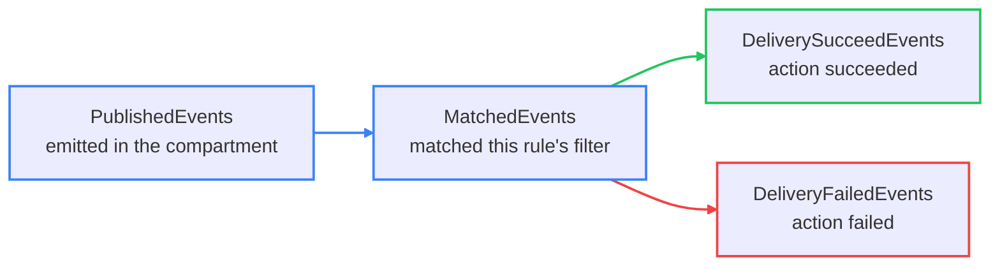
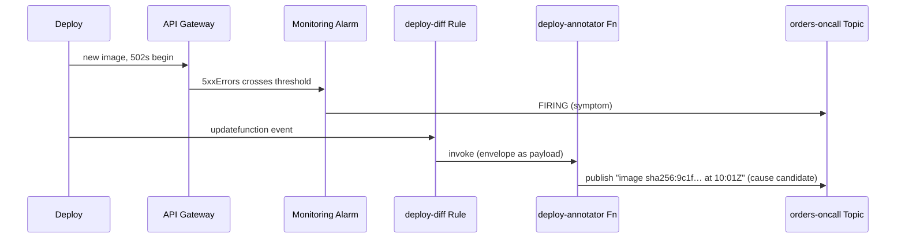

# The Events Service: Reacting to Resource State Changes

An event is a record that one OCI resource changed state — a bucket created, an instance stopped, a function updated, a backup finished. It is the fourth observability signal, and the one most often misread as a lightweight alarm — a confusion the *Events rule versus Monitoring alarm* section takes apart. `developer-professional/08` already covers the Events resource model, the CloudEvents envelope, and the `eventType` / attribute / tag filter grammar in full. This lesson covers what makes Events an *observability* tool: discovering event types, rule design discipline, and the rule metrics you alarm on.

---

## Contents

1. [Events as an Observability Signal](#1-events-as-an-observability-signal)
2. [Discovering What Emits Events](#2-discovering-what-emits-events)
3. [Rule Actions, Briefly](#3-rule-actions-briefly)
4. [Rule Design in Practice](#4-rule-design-in-practice)
5. [Rule Metrics as an Alarming Target](#5-rule-metrics-as-an-alarming-target)
6. [Worked Walkthrough: A Failed Deploy Drives an Automated Annotation](#6-worked-walkthrough-a-failed-deploy-drives-an-automated-annotation)
7. [Limits and Sources](#7-limits-and-sources)
8. [Summary](#8-summary)

---

## 1. Events as an Observability Signal

### 1.1 What the signal is, and what it is not

**An event marks a discrete, boolean fact: a named state change happened to a named resource.** There is no level and no rate — the object was created or it was not.

**Events are push-only with no retention.** An event with no matching rule at the instant it fires is gone; a rule created tomorrow cannot catch today's event. This is the sharpest contrast with the other three signals: a metric's data points sit in Monitoring for 90 days, a log sits in Logging for its retention, an event has neither.

### 1.2 Events rule versus Monitoring alarm

This is the lesson's named trade-off — the two automation triggers OCI gives you, for two different shapes of condition.

| | Events rule | Monitoring alarm |
| :--- | :--- | :--- |
| Fires on | A discrete resource state change | A metric value crossing a threshold over a window |
| Example trigger | "A backup completed", "an instance stopped" | "5xx rate > 10 for 3 minutes", "CPU absent 10m" |
| Latency | Near-real-time, no published SLA | One evaluation per minute |
| Misses | Anything expressible only as a number | Anything with no numeric metric |

> Note: the wrong model is treating a rule as a lightweight alarm. If your trigger is "a rate went up" or "a value got too high", it is an alarm — a rule has no concept of aggregation. If your trigger is "this specific thing happened to this resource", it is a rule.

---

## 2. Discovering What Emits Events

### 2.1 The event type is exact and not guessable

**A rule filters on `eventType`, and the string must be exact: `com.oraclecloud.<service>.<action>`.** The `<action>` token is service-specific and irregular — `createobject`, `updatefunction`, `instanceactionbegin`, `backupcomplete`. Guessing it wastes a rule that silently never matches.

Two ways to get the real value:

- **The Console rule-builder's event-type picker** lists every type, grouped by service — the authoritative source at rule-creation time.
- **The "Services that produce events" documentation reference** enumerates them per service for planning.

### 2.2 Not every state change is an event

**A service emits events only for the changes Oracle chose to publish.** Some state transitions are visible only in Audit logs (lesson `03`), not as events — check the reference before assuming a trigger exists.

```json
// A rule condition: a specific event type, narrowed by an attribute inside data.
// developer-professional/08 covers the full attribute and tag grammar.
{
  "eventType": ["com.oraclecloud.functions.updatefunction"],
  "data": { "compartmentId": "ocid1.compartment.oc1..orders" }
}
```

---

## 3. Rule Actions, Briefly

**A rule routes each match to a list of 1–10 actions, each of exactly three types.** A single rule can mix them; all listed actions fire off one match with no ordering between them.

| Action type | Reach for it when | Base treatment |
| :--- | :--- | :--- |
| Functions | The response needs custom logic | `developer-professional/04` |
| Streaming | The response needs a durable, replayable hand-off | `developer-professional/06` |
| Notifications | The response is a human notification or topic fan-out | Lesson `02` |

**The IAM grant names the Events service itself as the caller** — `service cloudevents`, not a dynamic group of your own resources — because it is OCI's Events service invoking your function or publishing to your topic on your behalf. `developer-professional/08` has the policy statements and the rationale, in its *Rule Actions* section.

---

## 4. Rule Design in Practice

### 4.1 Make every action idempotent

**Delivery is retried on failure and carries no exactly-once guarantee, so the same event can drive an action twice.** An action that "opens a ticket" or "sends a page" must dedupe on the event's `eventID` — otherwise a transient delivery retry produces two tickets.

### 4.2 Break the self-triggering loop

**A rule that reacts to `updateX` and whose action itself updates X re-emits `updateX`, matches its own rule, and loops** — burning function invocations and quota until someone notices.

```json
// The action tags its own changes; the rule excludes anything carrying that tag.
{
  "eventType": ["com.oraclecloud.autonomousdatabase.updateautonomousdatabase"],
  "data": {
    "definedTags": { "Automation": { "Source": { "not": "events-rule-remediation" } } }
  }
}
```

### 4.3 Filter as narrowly as the use case allows

**An `eventType`-only filter matches every occurrence across the whole compartment subtree.** Every match spends a delivery, and a Functions action spends an invocation. Narrow with attribute matching to the specific bucket, database, or instance the rule is actually for.

### 4.4 The rule-builder workflow

**Condition → actions → enable.** The condition is an event-type multi-select plus optional attribute and tag rules; the actions pane holds up to ten; the rule is disabled until you enable it.

```bash
oci events rule create --compartment-id "$C" --display-name "deploy-diff" \
  --is-enabled true \
  --condition '{"eventType":["com.oraclecloud.functions.updatefunction"]}' \
  --actions '{"actions":[{"actionType":"FAAS","isEnabled":true,"functionId":"'"$FN_OCID"'"}]}'
```

The CLI mirrors the Console: `--condition` is the filter, `--actions` is the list, `--is-enabled` is the final switch.

> ⚠️ A rule's scope cascades to child compartments. Place it no higher in the compartment tree than its intended blast radius — a parent-compartment rule silently picks up every child compartment created after it.

---

## 5. Rule Metrics as an Alarming Target

### 5.1 The funnel

**Four metrics in the `oci_cloudevents` namespace form a funnel; the stage where the count drops names the failure.**



*A drop between `PublishedEvents` and `MatchedEvents` is a filter problem; a drop between `MatchedEvents` and `DeliverySucceedEvents` is an action or IAM problem.*

### 5.2 Alarm on `MatchedEvents` reaching zero

**A filter that silently stops matching — a renamed resource, an event type changed by a service update — produces no `DeliveryFailedEvents`, only silence.** The only detector is an alarm on `MatchedEvents` itself, using lesson `02`'s model:

```text
MatchedEvents[5m]{resourceId = "ocid1.eventrule.oc1..deploy-diff"}.sum() == 0
```

Size `pendingDuration` to the longest normal gap between matches for that rule. Group an alarm by the `ACTIONTYPE` dimension to see *which* destination is failing when `DeliveryFailedEvents` climbs.

---

## 6. Worked Walkthrough: A Failed Deploy Drives an Automated Annotation

A bad deploy of `order-receipt-fn` in `orders-compartment`. Two independent things happen off the same cause.

1. **The alarm path.** The function starts returning `502`s; `oci_apigateway`'s `5xxErrors` alarm fires and pages the `orders-oncall` topic (lessons `01`, `02`). The responder knows a *symptom*.
2. **The event path, in parallel.** The deploy emits `com.oraclecloud.functions.updatefunction`. A standing rule `deploy-diff` — compartment `orders`, filter on that `eventType` — matches.
3. **One action.** The rule invokes the `deploy-annotator` Function with the event envelope as its payload.
4. **The annotation.** `deploy-annotator` reads `data.resourceId`, looks up the function's new image tag, and publishes a note to the *same* `orders-oncall` topic: "order-receipt-fn updated to image `sha256:9c1f…` at 10:01Z". The responder now sees a *cause candidate* next to the symptom.
5. **The rule's own metrics.** `MatchedEvents` for `deploy-diff` increments by 1; `DeliverySucceedEvents` by 1. Had `deploy-annotator` thrown, `DeliveryFailedEvents` would be 1 and a standing alarm on it would fire.



*The alarm path reports a symptom; the event path reports what changed just before it. Neither substitutes for the other.*

---

## 7. Limits and Sources

| Limit | What it forces | As-of + docs |
| :--- | :--- | :--- |
| 50 rules per tenancy | A rule slot is spent per distinct *filter*, not per destination — widen an action list before adding a rule | Sep 2026, [docs](https://docs.oracle.com/en-us/iaas/Content/Events/Concepts/eventsoverview.htm) |
| 1–10 actions per rule; three action types only (Functions, Streaming, Notifications) | A third-party target needs a pass-through Function you build, deploy, and monitor | Sep 2026, [docs](https://docs.oracle.com/en-us/iaas/Content/Events/Task/managingrules.htm) |
| Events are push-only with no retention or replay | Enable a rule before the traffic it must catch; a rule deployed late has a permanent hole behind it | Sep 2026, [docs](https://docs.oracle.com/en-us/iaas/Content/Events/Concepts/eventsoverview.htm) |
| No published matching or delivery latency; failed deliveries are retried | Treat delivery as near-real-time but neither instant nor exactly-once — make every action idempotent | Sep 2026, [docs](https://docs.oracle.com/en-us/iaas/Content/Events/Concepts/eventsoverview.htm) |
| A rule's scope cascades to child compartments | Place a rule no higher in the compartment tree than its intended blast radius | Sep 2026, [docs](https://docs.oracle.com/en-us/iaas/Content/Events/Concepts/eventsoverview.htm) |
| `oci_cloudevents` metrics: `PublishedEvents`, `MatchedEvents`, `DeliverySucceedEvents`, `DeliveryFailedEvents`; dimensions `RESOURCEID`, `EVENTTYPE`, `ACTIONTYPE`, `RESOURCEDISPLAYNAME` | Alarm on `MatchedEvents == 0`, not just on `DeliveryFailedEvents` — a broken filter produces silence, not failures | Sep 2026, [docs](https://docs.oracle.com/en-us/iaas/Content/Events/Reference/eventsmetrics.htm) |

> Note: the CloudEvents envelope, the full filter grammar, and the Events-vs-Queue-vs-Streaming choice are covered in `developer-professional/08`. The Events-rule-vs-alarm trade-off is inline at *Events rule versus Monitoring alarm*, above.

---

## 8. Summary

An event is a discrete, boolean record that a resource changed state. It is push-only and never retained, so a rule must exist before the event fires or the occurrence is lost. This is what separates a rule from a Monitoring alarm: a rule fires on "this happened to this resource", an alarm fires on "a number crossed a line", and neither can express the other's condition.

Writing a rule starts with the exact `com.oraclecloud.<service>.<action>` event-type string, taken from the Console picker or the services-that-produce-events reference rather than guessed. Good rule design is idempotent actions, a filter narrow enough to match only what the use case needs, and an exclusion condition on any rule whose action could re-trigger it.

A rule is monitored through four `oci_cloudevents` metrics that form a funnel from published to matched to delivered. The load-bearing alarm is `MatchedEvents` reaching zero: a filter that quietly stops matching emits no delivery failures, only silence, and nothing else will catch it. The worked walkthrough showed a rule and an alarm firing off one bad deploy — one reporting the change, the other the symptom.
