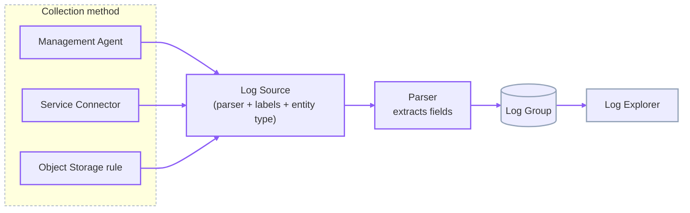
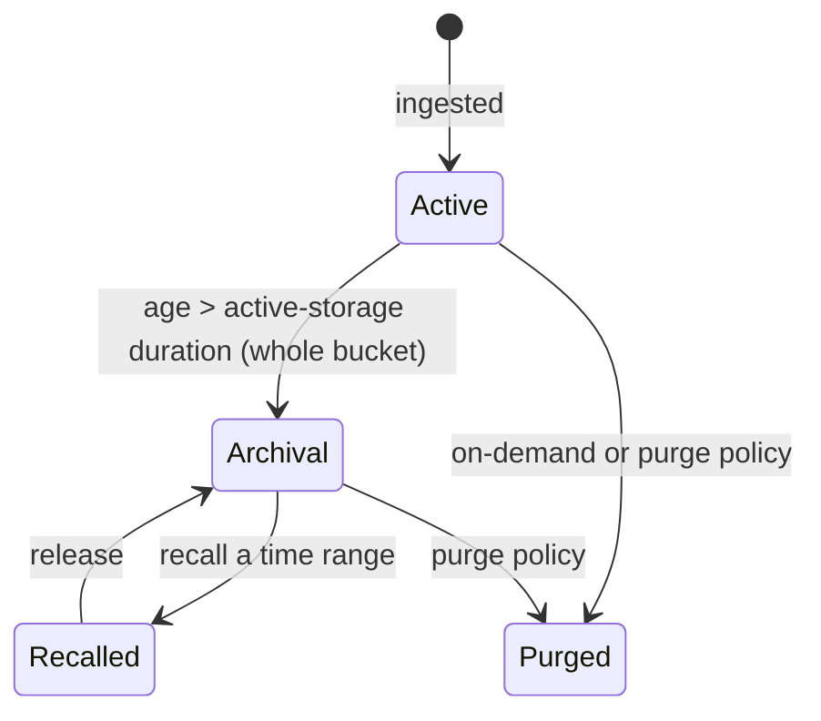
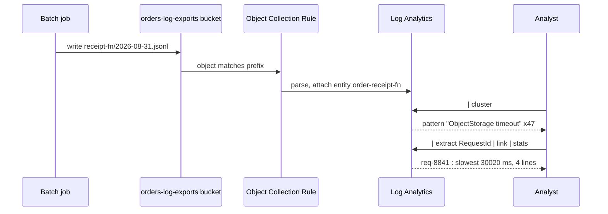

# Log Analytics: Parse-on-Ingest, Entities, and Correlation

Log Analytics is a separate service from the Logging service (lesson `03`), not a feature of it. The Logging service stores raw events and searches them with a light query language. Log Analytics **parses every log at ingest**, attaches it to a modelled **entity** (a host, a database, a load balancer), and indexes the extracted fields — so you can correlate across sources, cluster millions of lines into a handful of patterns, and stitch records into transactions with `link`. The cost of that power is an ingest-time processing step and a storage model with tiers to manage — the trade-off this lesson opens with.

---

## Contents

1. [Log Analytics Versus the Logging Service](#1-log-analytics-versus-the-logging-service)
2. [The Data Flow](#2-the-data-flow)
3. [Onboarding and the Default Groups](#3-onboarding-and-the-default-groups)
4. [Entities](#4-entities)
5. [Log Sources, Fields, Labels, and Lookups](#5-log-sources-fields-labels-and-lookups)
6. [The Query Language](#6-the-query-language)
7. [`cluster` and `link`](#7-cluster-and-link)
8. [Storage: Active, Archival, and Recall](#8-storage-active-archival-and-recall)
9. [The Three Ingestion Methods](#9-the-three-ingestion-methods)
10. [Worked Walkthrough: From an Uploaded Log File to a Transaction View](#10-worked-walkthrough-from-an-uploaded-log-file-to-a-transaction-view)
11. [Limits and Sources](#11-limits-and-sources)
12. [Summary](#12-summary)

---

## 1. Log Analytics Versus the Logging Service

**Both ingest logs; they differ in what happens at ingest and what you can ask afterward.**

| | Logging service (lesson `03`) | Log Analytics |
| :--- | :--- | :--- |
| At ingest | Stored as-is; `data` object kept whole | Parsed against a source's parser; fields extracted, entity attached, labels applied |
| Query | `search "<scope>" \| where …` over raw events | Pipe language with `stats`, `link`, `cluster`, `classify` over indexed fields |
| Correlation | By a shared field you filter on manually | By entity, by `link` transaction grouping, by lookup joins |
| Cost model | Ingestion + retention (30–180 days) | Ingestion + parsing + active-storage GB + optional archival |

**Reach for the Logging service** when you need the raw event fast and cheap, and a text or single-field filter is enough. **Reach for Log Analytics** when the question is analytical — patterns across a fleet, a transaction spanning services, a trend by entity — and worth the parse-time and storage overhead.

> Note: the two are not exclusive. A common setup keeps logs in the Logging service for cheap short-term search *and* forwards them to Log Analytics (via a Service Connector — see *The Three Ingestion Methods*) for analysis.

---

## 2. The Data Flow

**Every log takes the same path: a collection method delivers it, a log source names its parser and labels, the parser extracts fields, and the record lands in a log group for the Log Explorer to query.**



*The parse and field-extraction step in the middle is what the Logging service has no equivalent of — it is why a Log Analytics query can group by `Status Code` without the query itself parsing the line.*

---

## 3. Onboarding and the Default Groups

### 3.1 Onboarding is a one-time tenancy step

**Log Analytics is enabled per tenancy through an onboarding wizard that auto-creates the IAM policies the service needs** — including the policy that lets it collect OCI Audit logs. Onboarding (and off-boarding, and purging logs) is a privileged lifecycle action, not something a regular analyst can do.

### 3.2 The three conventional groups

| Group | Can |
| :--- | :--- |
| `Log-Analytics-Users` | Run queries, use dashboards, view logs |
| `Log-Analytics-Admins` | The above, plus manage sources, parsers, entities, lookups, storage settings |
| `Log-Analytics-SuperAdmins` | The above, plus onboard/off-board the tenancy and purge log data |

```text
Allow group Log-Analytics-SuperAdmins to use loganalytics-features-family  in tenancy
Allow group Log-Analytics-SuperAdmins to use loganalytics-resources-family in tenancy
Allow group Log-Analytics-Users       to read loganalytics-resources-family in compartment orders
```

> ⚠️ Only a `SuperAdmin` can purge. Wiring purge rights into the everyday analyst group is how log data gets deleted by accident.

---

## 4. Entities

### 4.1 An entity is what a log is *about*

**An entity is the modelled resource a log line describes — a compute host, an Autonomous Database, a load balancer.** Every parsed record is associated with one entity, which is how a query can say "errors on `orders-db`" without the log text mentioning `orders-db` at all.

### 4.2 Entity type, properties, and association

- **Entity type** — `Host (Linux)`, `Oracle Database`, `OCI Load Balancer`. The type determines which log sources and out-of-the-box parsers apply.
- **Properties** — connection details the type needs (a database entity carries host, port, service name).
- **Association** — binding a log source to an entity, so collected logs are attributed to it.

```text
# Register an Autonomous Database as an entity, then associate a log source
oci log-analytics entity create --namespace-name "$NS" --compartment-id "$C" \
  --name "orders-db" --entity-type-name "Oracle Cloud Database" \
  --cloud-resource-id "ocid1.autonomousdatabase.oc1..ordersdb"
```

### 4.3 Why the entity model matters

**Without entities, a fleet of 50 database hosts produces 50 undifferentiated log streams.** With them, every dashboard, alarm, and `link` analysis can group, filter, and roll up by the real-world resource — the same reason Stack Monitoring (lesson `07`) is built on a resource model.

---

## 5. Log Sources, Fields, Labels, and Lookups

### 5.1 A log source is the parsing contract

**A log source binds a collection pattern (a file path, a service log) to a parser, a set of labels, and an entity type.** Oracle ships hundreds of out-of-the-box sources (`OCI API Gateway Access Logs`, `Linux Secure Logs`); you define custom ones for your own applications.

### 5.2 Fields versus labels versus lookups

| Concept | Is | Example |
| :--- | :--- | :--- |
| **Field** | A value the parser extracts from the line | `Status Code`, `Client Host`, `Duration` |
| **Label** | A tag applied by a condition, not parsed from text | `Login Failure` when `Status Code = 401` |
| **Lookup** | An external table (CSV) joined at query time | Map `Client Host` → team name |

**A field comes from the log; a label is your interpretation layered on top; a lookup brings in data that was never in the log.** Confusing a label for a field is the common trap — a label exists only because you wrote a rule that assigns it.

```text
# A lookup joins a CSV keyed on an extracted field
'Log Source' = 'OCI API Gateway Access Logs'
  | lookup table = 'deployment-owners' select Owner using 'Deployment Id'
  | stats count as Requests by Owner
```

---

## 6. The Query Language

### 6.1 The pipe structure

**A query is a source selector piped through commands: `<selector> | command | command | …`.** Each command takes the row stream and reshapes it.

```text
'Log Source' = 'OCI API Gateway Access Logs' and 'Status Code' >= 500
  | stats count as Errors by 'Deployment Id', 'Status Code'
  | sort -Errors
```

### 6.2 The commands you use most

| Command | Does |
| :--- | :--- |
| `where` | Filters rows on a boolean expression |
| `fields` | Projects a subset of columns |
| `eval` | Computes a new field |
| `stats` | Aggregates (`count`, `avg`, `sum`, `min`, `max`, `distinctcount`) grouped `by` fields |
| `timestats` | `stats` bucketed over time, for a trend chart |
| `sort` | Orders rows (`-field` for descending) |
| `top` / `head` | The first N rows |
| `classify` | Groups results and flags anomalous groups automatically |

### 6.3 Field extraction at query time

**`extract` pulls a new field from an existing one with a pattern**, for when the parser did not capture something you now need:

```text
'Log Source' = 'Custom Orders App Logs'
  | extract field = Message 'order (?<OrderId>ORD-\d+)'
  | stats count by OrderId
```

---

## 7. `cluster` and `link`

### 7.1 `cluster`: collapse volume into patterns

**`cluster` groups records that are structurally similar, turning millions of lines into a short list of representative patterns with counts.** It is the first command to run against an unfamiliar noisy log — it surfaces the handful of distinct things happening.

```text
'Log Source' = 'Custom Orders App Logs' | cluster
-- returns e.g. 5 patterns: "Processed order * in * ms" (2.1M), "Retry * for order *" (840),
--   "ObjectStorage timeout after * ms" (12), ...
```

### 7.2 `link`: stitch records into transactions

**`link` groups records that share a value — a request ID, a session, a host — into one row per group, so a multi-line or multi-source interaction becomes a single analysable unit.** Add `stats` or `timestats` after it for per-transaction aggregates.

```text
'Log Source' in ('OCI API Gateway Access Logs', 'Custom Orders App Logs')
  | link span = 5minute Time, 'Request Id'
  | stats avg(Duration) as 'Avg ms', count as 'Log Lines' by 'Request Id'
  | where 'Avg ms' > 2000
```

*One `Request Id` value appearing in a gateway log and an application log collapses to one transaction row — the same correlation lesson `03` did by hand with two separate searches, done in one query here.*

---

## 8. Storage: Active, Archival, and Recall

### 8.1 Two tiers

**Ingested logs land in active storage, where they are queryable and feed the machine-learning features (anomaly detection, `classify`).** After a configured age they move to lower-cost archival storage, which is not directly queryable.



*Archival is by storage bucket, not by individual log: a bucket moves only when every log in it is older than the active-storage duration.*

### 8.2 The numbers that shape the design

- **Minimum active-storage duration is 30 days** (from each log's own timestamp); Oracle recommends 90 so the ML features have enough history.
- **Archiving can only be enabled once active storage holds at least 1 TB.**
- **Recall** brings an archived time range back into active storage for analysis; the range is snapped to bucket boundaries, and recalled data counts against active-storage usage until released.
- **Archival retention is indefinite by default**; an optional archival-storage duration purges beyond it.

> ⚠️ A purge policy that overlaps an archive or recall window can drop data mid-operation. Review purge and archival settings together.

### 8.3 Log groups are the access and retention boundary

**A Log Analytics log group is the unit that scopes access-control rules, retention, and archival settings — every ingested record is assigned to exactly one.** It is distinct from the IAM *groups* in *Onboarding and the Default Groups*: those govern *who* can act, a log group governs *which data* a rule or policy applies to. Partitioning within a log group organises records by source and time so a scoped query does not scan the whole group.

---

## 9. The Three Ingestion Methods

### 9.1 The choice

| Method | Use when | Mechanism |
| :--- | :--- | :--- |
| **Management Agent** | Continuous collection from Compute or on-prem hosts, databases, middleware | An agent on the host tails files and forwards to Log Analytics |
| **Service Connector** | The logs are already in the OCI Logging service | Connector Hub (lesson `03`) routes a Logging source into a Log Analytics log group |
| **Object Storage** | Batch or historical loads, third-party exports dropped in a bucket | An Object Collection Rule watches a bucket prefix and ingests matching objects |

### 9.2 Management Agent is not the Unified Monitoring Agent

**The Management Agent (here) collects for Log Analytics and Stack Monitoring. The Unified Monitoring Agent (lesson `03`) collects custom logs for the Logging service.** Different binaries, different configuration models, different destinations — a frequent exam trap. If the destination is a Log Analytics log group, it is the Management Agent.

### 9.3 The Object Collection Rule

```text
oci log-analytics object-collection-rule create --namespace-name "$NS" \
  --compartment-id "$C" --name "orders-archive-import" \
  --os-bucket-name "orders-log-exports" --os-namespace "$OS_NS" \
  --log-group-id "ocid1.loganalyticsloggroup.oc1..orders" \
  --log-source-name "Custom Orders App Logs" \
  --poll-since CURRENT_TIME
```

`--poll-since` controls whether the rule backfills existing objects (`BEGINNING`) or only picks up new ones (`CURRENT_TIME`).

---

## 10. Worked Walkthrough: From an Uploaded Log File to a Transaction View

An overnight batch job exports yesterday's `order-receipt-fn` logs to a bucket. The goal: find the slow requests and see each one's full cross-service story.

1. **Land the file.** The job writes `receipt-fn/2026-08-31.jsonl` to the `orders-log-exports` bucket.
2. **The Object Collection Rule ingests it.** `orders-archive-import` (the rule from *The Three Ingestion Methods*) matches the `receipt-fn/` prefix, parses each line with the `Custom Orders App Logs` source, and attributes records to the `order-receipt-fn` entity.
3. **Cluster to see what is in the file.** `... | cluster` returns four patterns; one is `ObjectStorage timeout after * ms` with a count of 47 — the signal.
4. **Extract the request ID.** The parser did not capture it, so `| extract field = Message 'req (?<RequestId>req-\w+)'` adds it.
5. **Link across sources.** The gateway access logs for the same day were forwarded by a Service Connector. One query links both:

   ```text
   'Log Source' in ('OCI API Gateway Access Logs', 'Custom Orders App Logs')
     | link span = 1hour Time, RequestId
     | stats max(Duration) as 'Slowest ms', count as Lines by RequestId
     | where 'Slowest ms' > 25000
   ```

6. **Read one transaction.** Expanding the `req-8841` row shows the gateway line (`502`, 30 s) and the three application lines (retry, retry, timeout) as one ordered story — the cross-service correlation done in a single query.



*The uploaded file and the connector-forwarded gateway logs meet in one `link` query, keyed on the request ID `extract` recovered.*

---

## 11. Limits and Sources

| Limit | What it forces | As-of + docs |
| :--- | :--- | :--- |
| Minimum active-storage duration 30 days; ML features want ~90 | Set active duration from how far back day-to-day troubleshooting and anomaly detection need to reach | Sep 2026, [docs](https://docs.oracle.com/en-us/iaas/log-analytics/doc/manage-storage.html) |
| Archiving requires ≥ 1 TB in active storage; archival is bucket-granular | A small tenancy cannot archive at all; a bucket waits until its *newest* log passes the active duration | Sep 2026, [docs](https://docs.oracle.com/en-us/iaas/log-analytics/doc/manage-storage.html) |
| Recalled archival data counts against active storage until released | Recall a narrow time range, analyse, release — an open-ended recall inflates the active-storage bill | Sep 2026, [docs](https://docs.oracle.com/en-us/iaas/log-analytics/doc/manage-storage.html) |
| Only `Log-Analytics-SuperAdmins` can onboard, off-board, or purge | Keep purge rights out of the analyst group; onboarding is a one-time privileged action | Sep 2026, [docs](https://docs.oracle.com/en-us/iaas/log-analytics/doc/enable-access-logging-analytics-its-resources.html) |
| Parsing happens at ingest against a fixed source/parser | A record parsed by the wrong source has wrong or missing fields and must be re-ingested to fix | Sep 2026, [docs](https://docs.oracle.com/en-us/iaas/logging-analytics/doc/logging-analytics-overview.html) |

> Note: the Logging-service-vs-Log-Analytics trade-off is inline at *Log Analytics Versus the Logging Service*. Connector Hub, the mechanism behind the Service Connector ingestion path, is lesson `03`.

---

## 12. Summary

Log Analytics parses each log at ingest, attaches it to an entity, and indexes the extracted fields, so its query language can aggregate and correlate in ways the Logging service's raw search cannot. The price is an ingest-time parse step bound to a log source, plus a two-tier storage model. Active storage is queryable and feeds the ML features; archival storage is cheaper and is neither. Reach for Log Analytics when the question is analytical and worth that overhead, and stay on the Logging service when a cheap single-field search is enough.

The service is built on entities and log sources. An entity is the real-world resource a log describes; a log source binds a collection method to a parser, a label set, and an entity type. Parsed fields come from the log, labels are conditions you layer on top, and lookups join data that was never in the log at all. The query language pipes a source selector through commands like `stats`, `timestats`, `classify`, and field extraction. Two commands carry this lesson's weight: `cluster` collapses volume into a handful of patterns, and `link` stitches records sharing a key into one transaction row.

Logs arrive by one of three methods — the Management Agent for continuous host collection, a Service Connector for logs already in the Logging service, or an Object Collection Rule for batches landed in Object Storage. The Management Agent is a different binary from lesson `03`'s Unified Monitoring Agent, with a different destination; confusing the two is a common mistake. The walkthrough took an uploaded file plus connector-forwarded gateway logs and resolved them into a single `link` transaction view keyed on a request ID.
