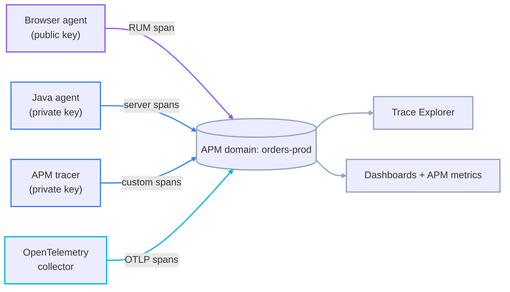
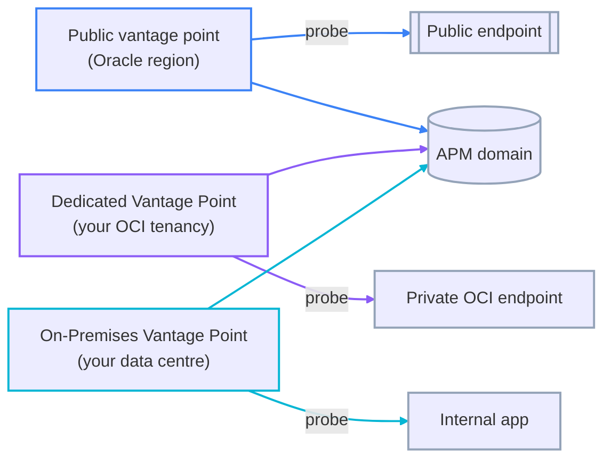
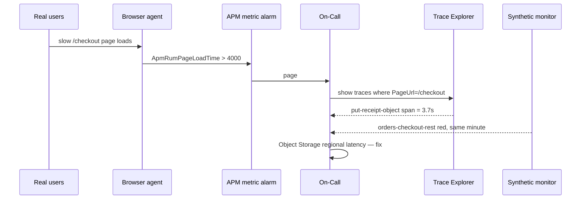

# Application Performance Monitoring: Domains, Data Sources, and the Three Monitoring Modes

`developer-professional/10` covered the trace: an **Application Performance Monitoring (APM)** domain, its two data keys, a span tree, and Trace Explorer. That is one of three things APM does. This lesson covers the other two — **Real User Monitoring (RUM)**, which watches actual browser sessions, and **Availability Monitoring** (the service Oracle renamed from *Synthetic Monitoring* in December 2024), which runs scripted probes on a schedule — plus the pieces that turn spans into alertable signal: **APDEX**, span-filter **metric groups**, and APM metric alarms. The recurring choice is RUM versus synthetic: the real user population you cannot control, against deterministic probes from vantage points you choose.

---

## Contents

1. [What This Lesson Adds Over the Trace](#1-what-this-lesson-adds-over-the-trace)
2. [APM Domain, Data Keys, and Setup](#2-apm-domain-data-keys-and-setup)
3. [Data Sources](#3-data-sources)
4. [Distributed Tracing Standards](#4-distributed-tracing-standards)
5. [Trace Explorer](#5-trace-explorer)
6. [Dashboards, Default Metrics, and APM Metric Alarms](#6-dashboards-default-metrics-and-apm-metric-alarms)
7. [APDEX](#7-apdex)
8. [Span Filters and Metric Groups](#8-span-filters-and-metric-groups)
9. [Real User Monitoring, Availability Monitoring, and Vantage Points](#9-real-user-monitoring-availability-monitoring-and-vantage-points)
10. [Worked Walkthrough: One Slow Checkout, From RUM Alert to Root-Cause Span](#10-worked-walkthrough-one-slow-checkout-from-rum-alert-to-root-cause-span)
11. [Limits and Sources](#11-limits-and-sources)
12. [Summary](#12-summary)

---

## 1. What This Lesson Adds Over the Trace

**A trace answers "where did the time go inside one request".** `developer-professional/10` covers that end in its APM and trace-instrumentation sections: the domain, the public and private data keys, the span tree in Trace Explorer, span attributes, automatic vs. manual instrumentation, and `X-B3` context propagation. This lesson does not repeat it.

**The three monitoring modes answer different questions:**

| Mode | Watches | Answers |
| :--- | :--- | :--- |
| Distributed tracing | Instrumented server-side code | Where the latency or error is, inside a request |
| Real User Monitoring | Real browsers loading your pages | What actual users are experiencing, right now |
| Availability Monitoring | Scripted probes on a schedule | Is the endpoint up and fast, from where I chose to check |

The rest of this lesson is the domain all three report into, the sources that feed it, and the ways a span becomes an alert.

---

## 2. APM Domain, Data Keys, and Setup

### 2.1 The domain is the collection boundary

**An APM domain is the resource every data source reports into** — one per environment or application is the usual split. It is created in a compartment and carries its own dashboards, alarms, and configuration (APDEX rules, span filters).

```text
oci apm-domain create --compartment-id "$C" --display-name "orders-prod" \
  --description "Orders app, production" --is-free-tier false
```

### 2.2 Two data keys, two trust levels

**A domain auto-generates a public and a private data key when it is created.** They gate who may write spans into the domain.

| Key | Used by | Safe to embed in |
| :--- | :--- | :--- |
| `auto_generated_public_datakey` | The browser / RUM agent | Client-side page source |
| `auto_generated_private_datakey` | The APM Java agent, the APM tracer, OpenTelemetry collectors | Server-side config only |

```text
oci apm-domain data-keys list --apm-domain-id "$DOMAIN_OCID"
```

> ⚠️ A leaked private data key lets anyone write arbitrary spans into your domain — and spans are billed. Treat it as a credential to rotate, not a config value. The public key is designed to be exposed; the private key never ships to a client.

### 2.3 Free-tier versus paid

**A free-tier domain caps ingestion and has no support commitment; a paid domain bills by span volume.** Billing is per 100,000 spans, reported in 15-minute intervals — so a chatty tracer with no sampling is a direct cost, which is why the tracer supports a sampling rate.

---

## 3. Data Sources

### 3.1 The matrix

**A data source is anything that produces spans or RUM/synthetic observations for a domain.**

| Source | Instruments | Choose it when |
| :--- | :--- | :--- |
| APM tracer (OpenTracing/OpenTelemetry SDK) | Code you add spans to by hand | You need custom spans the auto agents cannot see |
| APM Java agent | A running JVM, no code change | The workload is an unmodified Java service |
| Browser agent (RUM) | Client-side page loads, AJAX, JS errors | You need real end-user experience |
| OpenTelemetry ingest | Anything already emitting OTLP/Zipkin/Jaeger | Spans exist in an open format already |
| OpenTelemetry Operator for Kubernetes | Auto-injects instrumentation into pods | A Kubernetes fleet you do not want to rebuild image-by-image |

### 3.2 Agent hybrids

**The browser agent and the Java agent can run together on one application** so a single trace spans the browser page load and the server request it triggered — the RUM span becomes the root of the server-side span tree. The Console calls this the browser-agent / Java-agent hybrid.



*Every source writes into one domain; the key it authenticates with (violet public, blue private) is the only difference at ingest.*

---

## 4. Distributed Tracing Standards

### 4.1 What APM accepts

**APM ingests spans in several formats, so instrumentation is not locked to an Oracle SDK.**

- **W3C Trace Context** — the `traceparent` HTTP header standard for propagating a trace ID across services.
- **OpenTelemetry (OTLP)** — the vendor-neutral instrumentation and wire format; APM has an OTLP ingest endpoint.
- **Zipkin B3 and Jaeger** — older span formats APM still accepts, so existing instrumentation keeps working.

### 4.2 The span journey

**Instrument → generate spans → batch to the collector endpoint → domain stores and indexes.** The collector endpoint is regional and authenticates with the private data key.

> Note: context propagation — how the *same* trace ID threads every hop so the spans form one tree — is the `X-B3` / `traceparent` header mechanism covered in `developer-professional/10`'s trace-instrumentation section. This lesson assumes it.

### 4.3 Enabling tracing for OCI Functions

**Turning on tracing for a Functions application produces a default invocation span with no code change**, authenticated automatically. A handler adds manual child spans with the tracing context OCI injects.

```text
oci fn application update --application-id "$APP_OCID" \
  --trace-config '{"isEnabled": true, "domainId": "'"$DOMAIN_OCID"'"}'
```

---

## 5. Trace Explorer

### 5.1 The query surface

**Trace Explorer queries spans and traces with a SQL-like language over span attributes.** Attributes are of two kinds: **dimensions** (string-valued, filterable and groupable — `ServiceName`, `OperationName`, `Status`) and **metrics** (numeric — `Duration`, `SpanCount`).

```sql
show traces
where ServiceName = 'order-receipt-fn' and Duration > 25000
order by TraceStartTime desc
```

### 5.2 The views

| View | Shows |
| :--- | :--- |
| Trace list | Matching traces, one row each, with root duration and error flag |
| Trace Details | The span waterfall for one trace, plus any logs linked by trace ID |
| GeoMap | Where RUM sessions or synthetic runs originated, by region |
| Topology | Each service in the trace as a node, edges weighted by call volume and latency |

---

## 6. Dashboards, Default Metrics, and APM Metric Alarms

### 6.1 APM publishes into the Monitoring service

**APM aggregates spans into metrics in `oracle_apm*` namespaces, so lesson `02`'s alarm model applies unchanged.** Default dimensions include `ServiceName`, `OperationName`, and the APM domain.

### 6.2 An alarm on an APM metric

```text
ApmSyntheticHttpResponseTime[1m]{MonitorName = "orders-checkout-rest"}.mean() > 3000
```

Wire it to a Notifications topic exactly as in lesson `02` — the alarm engine does not know or care that the metric came from APM rather than from a compute instance.

### 6.3 Custom dashboards

**A custom dashboard pins Trace Explorer queries, metric charts, and APDEX widgets into one view**, scoped to a domain. Oracle also ships default dashboards per data source.

---

## 7. APDEX

### 7.1 The score

**APDEX (Application Performance Index) compresses a latency distribution into one 0–1 number** by sorting requests into three buckets against two thresholds set at the domain level:

- **Satisfied** — response time ≤ threshold *T*.
- **Tolerating** — between *T* and 4×*T* (the tolerable threshold).
- **Frustrated** — slower than the tolerable threshold, or errored.

```text
APDEX = (satisfied count + tolerating count / 2) / total requests
```

A score of 1.0 means every request was satisfied; 0.5 means every request was merely tolerated.

### 7.2 Where it applies

**APDEX is computed per operation, per service, and per RUM page**, so a single slow endpoint shows up as a dip in that operation's score without dragging the whole service to zero.

```text
oci apm-config config create --apm-domain-id "$DOMAIN_OCID" --config-type APDEX \
  --config '{"rules":[{"filterText":"kind=\"SERVER\"","satisfiedResponseTime":300,"toleratingResponseTime":1200,"isApplyToErrorSpans":true}]}'
```

---

## 8. Span Filters and Metric Groups

### 8.1 Deriving a metric from a span filter

**A span filter is a saved Trace Explorer predicate; a metric group turns that filter into a continuous metric stream in the Monitoring service.** This is how you alarm on "the p90 latency of *just* the checkout operation" without that being a metric APM ships by default.

### 8.2 Custom span dimensions

**Add a custom dimension to a span (a tenant ID, a plan tier, a region) and a metric group can group by it** — so one span filter yields per-tenant latency without a metric per tenant defined by hand.

> ⚠️ The cardinality rule from lesson `02`'s custom-metrics section applies here too: a custom span dimension with unbounded values (a raw user ID, a request ID) explodes the derived metric into thousands of streams. Keep span dimensions bounded.

---

## 9. Real User Monitoring, Availability Monitoring, and Vantage Points

### 9.1 The trade-off

| | Real User Monitoring | Availability Monitoring (synthetic) |
| :--- | :--- | :--- |
| Traffic | Actual user sessions | Scripted probes you define |
| Coverage | Only what users actually do | Every path you script, on a schedule |
| Timing | Only when users are active | Continuous, including 3 a.m. and pre-launch |
| Geography | Wherever your users are | Vantage points you pick |
| Blind spot | A page no one visited tonight | A user flow you forgot to script |

**Run both.** RUM tells you what is happening to real people; synthetic tells you whether an endpoint is up when no one is looking and catches a regression before users hit it.

### 9.2 RUM: the browser agent

**A single script tag loads the browser agent, authenticated with the public data key**, and it reports page-load timing, AJAX calls, JS errors, and session geography.

```html
<script src="https://cdn.apm.<region>.oci.oraclecloud.com/.../apm-web-<ver>.js"
        data-apm-key="AUTO_GENERATED_PUBLIC_DATAKEY"
        data-apm-domain="orders-prod"></script>
```

### 9.3 Availability Monitoring: monitor types and vantage points

**A monitor is a script plus a schedule plus a set of vantage points.** Types include scripted REST, browser and scripted-browser (a recorded UI flow), and network checks (ping, TCP, DNS).

- **Oracle public vantage points** — Oracle-run locations worldwide; the default, no setup.
- **Dedicated Vantage Point (DVP)** — a vantage point you run in your own OCI tenancy, for probing an endpoint that is not reachable from the public internet, or from a network location Oracle does not offer.
- **On-Premises Vantage Point (OPVP)** — a DVP packaged to run inside your own data centre, for monitoring an internal application from where your users actually sit.

| Vantage point | Runs in | Reaches |
| :--- | :--- | :--- |
| Public | Oracle regions | Public internet endpoints |
| DVP | Your OCI tenancy (a compartment/VCN) | Private OCI endpoints, a chosen region |
| OPVP | Your own data centre | Internal apps behind the corporate firewall |



*All three probe types report results to the same domain; they differ only in where the probe runs and therefore what it can reach.*

```text
oci apm-synthetics monitor create --apm-domain-id "$DOMAIN_OCID" \
  --display-name "orders-checkout-rest" --monitor-type SCRIPTED_REST \
  --repeat-interval-in-seconds 300 --vantage-points '["aws-us-ashburn-1"]' \
  --script-id "$SCRIPT_OCID"
```

> Note: the course and older docs call this **Synthetic Monitoring**; Oracle renamed it **Availability Monitoring** in December 2024. The technique is unchanged — synthetic, scripted probes — and "synthetic" still names the monitor category.

---

## 10. Worked Walkthrough: One Slow Checkout, From RUM Alert to Root-Cause Span

The `orders-web` front end (browser agent) and `order-receipt-fn` (Functions tracing) both report to the `orders-prod` domain. Checkout gets slow for real users one evening.

1. **RUM catches it first.** The browser agent reports rising page-load time on `/checkout`; the RUM APDEX for that page drops from 0.95 to 0.6. A metric-group alarm on `ApmRumPageLoadTime` for `PageUrl = /checkout` crosses 4000 ms and pages `orders-oncall` (lesson `02`).
2. **Confirm it is real users, not one bot.** GeoMap shows the slow sessions spread across three regions and dozens of sessions — a real regression, not a single client.
3. **Follow the hybrid trace.** Because `orders-web` and the backend share the domain, a slow `/checkout` RUM span is the root of a server-side trace. Trace Explorer: `show traces where PageUrl = '/checkout' and Duration > 4000`.
4. **Localise the span.** Trace Details shows the waterfall: browser render 200 ms, gateway 10 ms, `order-receipt-fn` invocation span 3.8 s, and inside it a `put-receipt-object` child span holding 3.7 s.
5. **Check the synthetic monitor.** `orders-checkout-rest` — the scripted REST monitor from a public vantage point — went red at the same minute, which rules out "only real browsers" and points at the backend dependency.
6. **Root cause.** Object Storage latency in one region. The fix restores both the RUM APDEX and the synthetic monitor to green.



*RUM proved users were affected; the hybrid trace localised the span; the synthetic monitor confirmed it was the backend, not the browser.*

---

## 11. Limits and Sources

| Limit | What it forces | As-of + docs |
| :--- | :--- | :--- |
| Billing is per 100,000 spans, reported in 15-minute intervals | An unsampled tracer is a direct cost line; set a sampling rate deliberately | Sep 2026, [docs](https://docs.oracle.com/en/cloud/paas/application-performance-monitoring/oci_apm_faq/) |
| A domain auto-generates one public and one private data key; the private key can write arbitrary billed spans | Never ship the private key to a client; rotate it if exposed | Sep 2026, [docs](https://docs.oracle.com/en-us/iaas/application-performance-monitoring/doc/obtain-data-upload-endpoint-and-data-keys.html) |
| APDEX uses two domain-level thresholds; tolerating is the band up to 4× the satisfied threshold | One threshold pair per rule — set it per operation class, not one global value | Sep 2026, [docs](https://docs.oracle.com/en-us/iaas/application-performance-monitoring/doc/configure-apdex-thresholds.html) |
| A metric group derived from a span filter inherits span-dimension cardinality | An unbounded custom span dimension explodes the derived metric; keep span dimensions bounded | Sep 2026, [docs](https://docs.oracle.com/en-us/iaas/application-performance-monitoring/doc/application-performance-monitoring-service-limits.html) |
| Trace data retention is a bounded window, not indefinite (verify the current value for your tenancy) | Long-term trace analysis needs the data exported; APM metrics in `oracle_apm*` follow Monitoring's 90-day retention | Sep 2026, [docs](https://docs.oracle.com/en-us/iaas/application-performance-monitoring/doc/application-performance-monitoring-service-limits.html) |
| APM resource limits are regional | A multi-region app needs a domain (and its span budget) per region | Sep 2026, [docs](https://docs.oracle.com/en-us/iaas/application-performance-monitoring/doc/application-performance-monitoring-service-limits.html) |

> Note: the trace/span model, Trace Explorer basics, and context propagation are covered in `developer-professional/10`'s APM sections. The RUM-vs-synthetic trade-off is inline at *Real User Monitoring, Availability Monitoring, and Vantage Points*. "Synthetic Monitoring" was renamed "Availability Monitoring" in December 2024.

---

## 12. Summary

APM does three things into one domain. Distributed tracing shows where time went inside a request; `developer-professional/10` covers that end. Real User Monitoring watches actual browser sessions with the public-data-key browser agent, and Availability Monitoring — the service formerly called Synthetic Monitoring — runs scripted probes on a schedule from vantage points you choose. The standing trade-off is that RUM sees only what users do while synthetic covers every path you script whenever you script it, so production runs both.

A domain issues a public and a private data key. The public key is designed for client-side code. The private key authenticates the Java agent, the tracer, and OpenTelemetry collectors, and must never reach a client because it can write billed spans. Every data source converges on the same domain, Trace Explorer, and dashboards, differing only in the key it presents and the format it sends.

Spans become alertable signal three ways. APM aggregates them into `oracle_apm*` metrics that lesson `02`'s alarm model consumes directly. APDEX compresses a latency distribution into a 0–1 score per operation, service, and RUM page against two domain-level thresholds. A span filter plus a metric group turns any saved Trace Explorer predicate into a continuous metric — subject to the same dimension-cardinality discipline as any custom metric.
