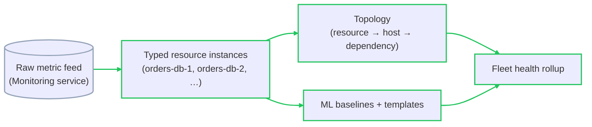
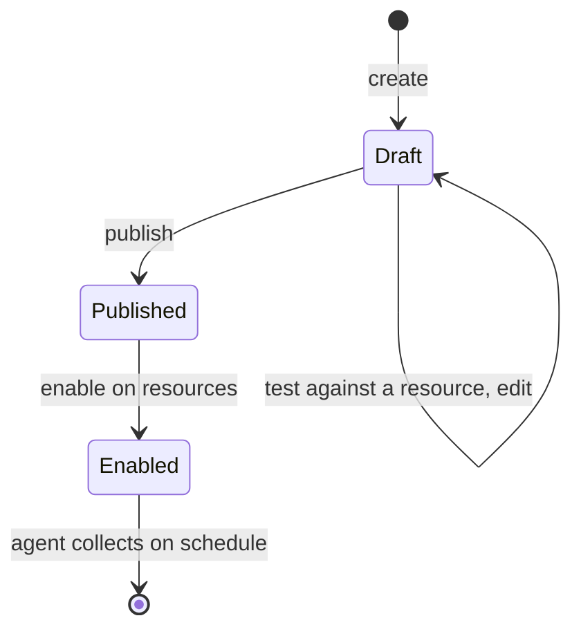
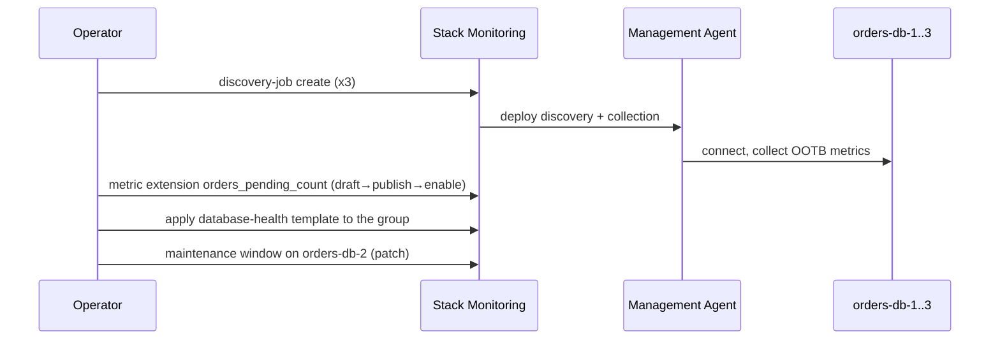

# Stack Monitoring: A Resource Model Over the Raw Metric Feed

The Monitoring service (lesson `02`) hands you metric namespaces and static-threshold alarms; assembling a fleet-wide health picture from them is manual. Stack Monitoring adds the layer above: a **resource model** — typed resource instances (`Oracle Database`, `Host`, `WebLogic Domain`), a topology linking them, out-of-the-box metrics per type, machine-learned baselines, and alarm templates you apply across a whole resource group at once. The trade-off is scope for control: you monitor a database *as a database*, with metrics and health rules Oracle already defined, rather than wiring every metric by hand.

> Scope note: Stack Monitoring is a full workshop module but is **not** in Oracle's "Skills you will learn" list for this certification. Know the model and the vocabulary; weight it below lessons `02`–`06` for exam preparation.

---

## Contents

1. [Stack Monitoring Versus the Raw Monitoring Service](#1-stack-monitoring-versus-the-raw-monitoring-service)
2. [Resource Discovery](#2-resource-discovery)
3. [Monitoring Custom Resources](#3-monitoring-custom-resources)
4. [Baselines, Anomalies, and Metric Extensions](#4-baselines-anomalies-and-metric-extensions)
5. [Monitoring Templates and Maintenance Windows](#5-monitoring-templates-and-maintenance-windows)
6. [Worked Walkthrough: Discovering a Database Fleet and Alarming Across It](#6-worked-walkthrough-discovering-a-database-fleet-and-alarming-across-it)
7. [Limits and Sources](#7-limits-and-sources)
8. [Summary](#8-summary)

---

## 1. Stack Monitoring Versus the Raw Monitoring Service

### 1.1 What the resource model buys

**A Stack Monitoring resource is a typed object with a known set of metrics, a health state, and a place in a topology.** Discover an `Oracle Database` and you immediately get tablespace usage, session counts, wait classes, and a rolled-up health status — without naming a single metric.



*Stack Monitoring consumes the same metric feed as lesson `02`, then layers typing, topology, baselines, and a fleet-wide health rollup on top of it.*

| | Monitoring service | Stack Monitoring |
| :--- | :--- | :--- |
| Unit | A metric namespace | A typed resource instance |
| Metrics | You know the namespace and dimensions | Defined by the resource type, out of the box |
| Health | You build it from alarms | A rolled-up status per resource and per fleet |
| Alarming at scale | One alarm, or a fuzzy dimension filter | A template applied to a resource group |
| Baseline | A static threshold you pick | A machine-learned band per metric |

### 1.2 The cost of the model

**You monitor what the resource type supports.** A metric the type does not define is not there until you add it as a metric extension (the *Baselines, Anomalies, and Metric Extensions* section). The gain is that a 200-database fleet is 200 uniformly-monitored resources on day one, not 200 hand-built dashboards.

---

## 2. Resource Discovery

### 2.1 The discovery job

**Discovery is an API-driven job: you submit connection details for a resource, and Stack Monitoring creates the typed resource and starts collecting.** For OCI-native resources (an Autonomous Database, a compute host) discovery can enroll them directly; for external or on-prem resources it runs through a Management Agent.

```text
oci stack-monitoring discovery-job create --compartment-id "$C" \
  --discovery-type ADD --discovery-details '{
    "resourceName": "orders-db-1",
    "resourceType": "ORACLE_DATABASE",
    "agentId": "'"$MGMT_AGENT_OCID"'",
    "properties": { "propertiesMap": { "port": "1521", "serviceName": "orderspdb" } }
  }'
```

### 2.2 The Management Agent

**The Management Agent carries the Stack Monitoring plug-in, which auto-installs when the agent is enrolled** — the same Management Agent that ships logs to Log Analytics (lesson `05`), a different binary from lesson `03`'s Unified Monitoring Agent. One agent on a host can discover and monitor every database and middleware instance on it.

### 2.3 Discovery best practices

- **Discover the host first, then what runs on it** — so the topology links the database to its host.
- **Use a dedicated monitoring credential** with least privilege, not an admin account.
- **A failed discovery is usually connectivity or credentials** — the agent must reach the resource's listener, and the credential must have the monitoring role the type requires.

---

## 3. Monitoring Custom Resources

### 3.1 Beyond the built-in types

**Stack Monitoring can model resources it has no built-in type for**, so a bespoke daemon or a third-party system still gets a health state and a place in the topology.

- **Any host process as a resource** — point Stack Monitoring at a process name; it tracks liveness and basic resource usage as a first-class resource.
- **Prometheus, Telegraf, and collectd** — an existing exporter's metrics are ingested and attached to an out-of-the-box or custom resource type, so a Kubernetes or Linux fleet already running these keeps its instrumentation.
- **Enrich topology with OCI services** — link a discovered application to the OCI Load Balancer or Object Storage bucket it depends on, so the topology spans your resources and OCI's.

---

## 4. Baselines, Anomalies, and Metric Extensions

### 4.1 Machine-learned baselines

**Stack Monitoring learns a normal range for each metric from its history and flags departures from it** — distinct from a static alarm threshold. A metric with a daily cycle (busy by day, idle at night) gets a band that follows the cycle, so an anomaly alert fires on "unusual for this time", not "above a fixed number that is only right at midday".

> Note: a learned baseline complements a static alarm, it does not replace it. Keep a hard alarm for the value that means "page someone regardless of history" (a filesystem at 100%); use the baseline for the drift a fixed threshold would miss or false-fire on.

### 4.2 Metric extensions

**A metric extension adds a metric to a resource type by defining a probe** — a SQL query, a JMX attribute, an OS command — that the Management Agent runs on a schedule.



*The draft phase exists so a probe is validated against a real resource before it is deployed fleet-wide.*

```text
oci stack-monitoring metric-extension create --compartment-id "$C" \
  --display-name "orders_pending_count" --resource-type "ORACLE_DATABASE" \
  --collection-recurrences "FREQ=MINUTELY;INTERVAL=5" \
  --query-properties '{
    "collectionMethod": "SQL",
    "sqlDetails": { "content": "SELECT COUNT(*) AS pending FROM orders WHERE status = '\''PENDING'\''" }
  }'
```

Once enabled, `orders_pending_count` behaves like any built-in metric — chartable, alarmable, baseline-tracked.

---

## 5. Monitoring Templates and Maintenance Windows

### 5.1 Monitoring templates

**A monitoring template is a reusable set of alarm definitions applied to a resource group in one action.** Define "database health" once — tablespace above 90%, blocked sessions above N, the instance down — and apply it to every `Oracle Database` in a compartment, including ones discovered later.

This is the resource-model answer to lesson `02`'s "one alarm per condition": you still write one condition per failure mode, but you write it once per *type*, not once per *instance*.

### 5.2 Maintenance windows

**A maintenance window suppresses a resource's alarms — and its contribution to fleet health rollups — for a scheduled period, and auto-creates the alarm suppression for every alarm the resource could raise.** Patching a database at 2 a.m. then produces no pages and no red on the fleet dashboard, while the underlying metric collection continues.

```text
oci stack-monitoring maintenance-window create --compartment-id "$C" \
  --name "orders-db-2-patch" --resources '[{"resourceId":"'"$DB2_OCID"'"}]' \
  --schedule '{"scheduleType":"ONE_TIME","timeMaintenanceWindowStart":"2026-09-06T02:00:00Z",
               "maintenanceWindowDuration":"PT2H"}'
```

> ⚠️ Like lesson `02`'s alarm suppression, a maintenance window stops *notifications*, not *evaluation*. A problem that starts during the window and persists past it will alarm when the window closes.

---

## 6. Worked Walkthrough: Discovering a Database Fleet and Alarming Across It

Three Autonomous Databases back the `orders` app: `orders-db-1`, `orders-db-2`, `orders-db-3`. The goal is uniform monitoring with one alarm definition and a clean patch window.

1. **Discover the host and agent.** A Management Agent on the monitoring host is enrolled; its Stack Monitoring plug-in installs automatically.
2. **Discover the three databases.** One `discovery-job create` per database, as in the *Resource Discovery* section, each with the monitoring credential and the listener details. Stack Monitoring creates three `ORACLE_DATABASE` resources and links each to its host in the topology.
3. **Out-of-the-box metrics arrive immediately.** Tablespace usage, session counts, and a health status appear for all three with no metric named by hand.
4. **Add a business metric.** The metric extension `orders_pending_count` from the *Baselines, Anomalies, and Metric Extensions* section is drafted, tested against `orders-db-1`, published, and enabled on all three.
5. **Apply one template.** A `database-health` monitoring template — tablespace > 90%, instance down, `orders_pending_count` baseline anomaly — is applied to the compartment's `ORACLE_DATABASE` group. All three databases are now covered by one definition; a fourth discovered next month inherits it.
6. **Patch cleanly.** Before a Sunday patch of `orders-db-2`, a maintenance window is opened on that resource. It patches with no pages and no fleet-health red; the window closes and normal alarming resumes.



*One discovery per database, one metric extension, one template — the fleet is uniformly monitored and a new member inherits the template automatically.*

---

## 7. Limits and Sources

| Limit | What it forces | As-of + docs |
| :--- | :--- | :--- |
| A resource is monitored only for the metrics its type defines | A business or app-specific metric needs a metric extension; there is no ad-hoc metric on a typed resource | Sep 2026, [docs](https://docs.oracle.com/en-us/iaas/stack-monitoring/doc/metric-extensions.html) |
| A metric extension must pass a draft/test phase before publish | Validate a SQL/JMX/OS probe against one real resource before deploying it fleet-wide | Sep 2026, [docs](https://docs.oracle.com/en-us/iaas/stack-monitoring/doc/metric-extensions.html) |
| Discovery of external resources runs through a Management Agent | An unreachable listener or an under-privileged monitoring credential fails discovery silently until fixed | Sep 2026, [docs](https://docs.oracle.com/en-us/iaas/stack-monitoring/doc/service-requirements.html) |
| A maintenance window suppresses notifications and health rollups, not metric collection | A fault that outlives the window alarms when it closes; the window is not a fix | Sep 2026, [docs](https://docs.oracle.com/en-us/iaas/stack-monitoring/doc/metric-extensions.html) |
| Baselines are learned from metric history | A newly discovered resource has no baseline until enough history accumulates; static alarms cover the gap | Sep 2026, [docs](https://docs.oracle.com/en-us/iaas/stack-monitoring/doc/stack-monitoring.html) |

> Note: Stack Monitoring publishes and alarms through the same Monitoring and Notifications services as lesson `02`; the resource model is the layer on top.

---

## 8. Summary

Stack Monitoring puts a resource model over the raw metric feed. A resource is a typed instance — a database, a host, a middleware domain — that arrives with out-of-the-box metrics, a health state, and a topology link the moment it is discovered. The trade-off against the Monitoring service is scope for control: uniform monitoring of a whole fleet on day one, at the price of monitoring only what each resource type defines until you extend it.

Discovery is an API job that enrolls a resource and, for anything external, runs through the Management Agent — the same agent lesson `05` uses for Log Analytics, not lesson `03`'s Unified Monitoring Agent. Custom and third-party resources are modelled too, through host-process monitoring or by ingesting Prometheus, Telegraf, and collectd metrics. A metric extension adds a metric to a type via a scheduled SQL, JMX, or OS-command probe, gated by a draft-and-test phase before it publishes.

At scale the model pays off through templates and windows. A monitoring template applies one set of alarm definitions to every resource in a group, including future members. A machine-learned baseline flags "unusual for this time" where a static threshold cannot, complementing rather than replacing the hard alarms. A maintenance window suppresses a resource's alarms and its health-rollup contribution during planned work — stopping notifications, not evaluation, exactly as lesson `02`'s suppression does. This closes the track: seven services, four signals, one troubleshooting picture.
