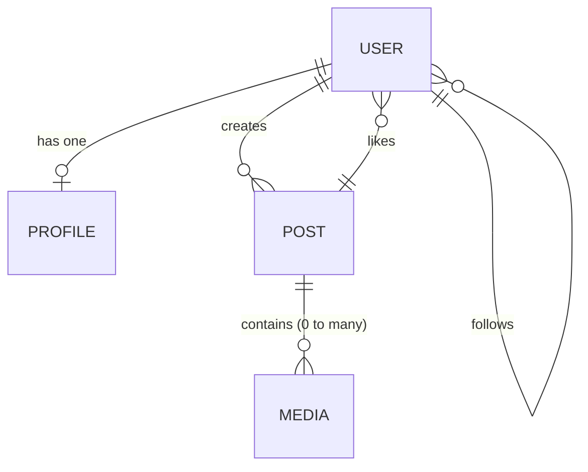

# Exercise 1 - RDB

1. Set up a SQL DB
2. Create a schema for social network (user, post, profile, photos, following)
3. Insert data (in user and profile) in one transaction


## Setup

Install postgresql helm 

```sh
helm install my-release oci://registry-1.docker.io/bitnamicharts/postgresql
```

To execute PSQL commands

```sh
export POSTGRES_PASSWORD=$(kubectl get secret --namespace default my-release-postgresql -o jsonpath="{.data.postgres-password}" | base64 -d)
kubectl run my-release-postgresql-client --rm --tty -i --restart='Never' --namespace default --image registry-1.docker.io/bitnami/postgresql:latest --env="PGPASSWORD=$POSTGRES_PASSWORD" \
      --command -- psql --host my-release-postgresql -U postgres -d postgres -p 5432
```

## Schema Design

- A user have a profile
- A user can create post
- A user can follow another user
- A user can like a post
- A post can contain 0 to many media (images, videos, audios) and text



Assumptions
- Media in posts are not ordered
- Post must have text
- Developers will not updated created_at or updated_at (remove service account access to update such fields - eg `REVOKE UPDATE (created_at, updated_at) ON users FROM app_user;`)
- case sensitive username and email

```sql
-- Most table will have created_at and updated_at
-- Updated at will be attached with trigger
CREATE OR REPLACE FUNCTION set_updated_at()
RETURNS TRIGGER AS $$
BEGIN
  NEW.updated_at = NOW();
  RETURN NEW;
END;
$$ LANGUAGE plpgsql;

-- User table with basic cred
CREATE TABLE users (
    user_id BIGSERIAL PRIMARY KEY,          -- SERIAL for lower count
    username VARCHAR(50) UNIQUE NOT NULL, 
    email VARCHAR(254) UNIQUE NOT NULL,
    password_hash VARCHAR(255) NOT NULL,
    created_at TIMESTAMPTZ DEFAULT NOW(),
    updated_at TIMESTAMPTZ DEFAULT NOW()
);
CREATE TRIGGER trigger_users_updated_at
BEFORE UPDATE ON users
    FOR EACH ROW
    EXECUTE FUNCTION set_updated_at();

-- Profiles for user (1:1)
-- Reference user_id and delete on cascade
CREATE TABLE profiles (
    profile_id BIGSERIAL PRIMARY KEY,
    user_id BIGINT UNIQUE NOT NULL REFERENCES users(user_id) ON DELETE CASCADE,
    display_name VARCHAR(100),
    bio TEXT,
    avatar_url VARCHAR(500),
    created_at TIMESTAMPTZ DEFAULT NOW(),
    updated_at TIMESTAMPTZ DEFAULT NOW()
);
CREATE TRIGGER trigger_profiles_updated_at
BEFORE UPDATE ON profiles
    FOR EACH ROW
    EXECUTE FUNCTION set_updated_at();

-- Post by users (1 user: N posts)
-- Reference user_id and delete on cascade
CREATE TABLE posts (
    post_id BIGSERIAL PRIMARY KEY,
    user_id BIGINT NOT NULL REFERENCES users(user_id) ON DELETE CASCADE,
    content TEXT NOT NULL,
    created_at TIMESTAMPTZ DEFAULT NOW(),
    updated_at TIMESTAMPTZ DEFAULT NOW()
);
CREATE INDEX idx_posts_user_id ON posts(user_id);
CREATE INDEX idx_posts_created_at ON posts(created_at DESC);
CREATE TRIGGER trigger_posts_updated_at
BEFORE UPDATE ON posts
    FOR EACH ROW
    EXECUTE FUNCTION set_updated_at();

-- Media to be attached in posts (1 post: N media)
-- Reference post_id and delete on cascade
CREATE TABLE media (
    media_id BIGSERIAL PRIMARY KEY,
    post_id BIGINT NOT NULL REFERENCES posts(post_id) ON DELETE CASCADE,
    media_url VARCHAR(500) NOT NULL,
    media_type VARCHAR(20) NOT NULL CHECK (media_type IN ('image', 'video', 'audio')),
    created_at TIMESTAMPTZ DEFAULT NOW(),
    updated_at TIMESTAMPTZ DEFAULT NOW()
);
CREATE INDEX idx_media_post_id ON media(post_id);
CREATE TRIGGER trigger_media_updated_at
BEFORE UPDATE ON media
    FOR EACH ROW
    EXECUTE FUNCTION set_updated_at();

-- Likes on post (1 post: N likes. Constraint single user single like on a post)
CREATE TABLE likes (
    user_id BIGINT NOT NULL REFERENCES users(user_id) ON DELETE CASCADE,
    post_id BIGINT NOT NULL REFERENCES posts(post_id) ON DELETE CASCADE,
    created_at TIMESTAMPTZ DEFAULT NOW(),
    PRIMARY KEY (user_id, post_id) 
);
CREATE INDEX idx_likes_post_id ON likes(post_id);
CREATE INDEX idx_likes_user_id ON likes(user_id);

-- Followers of a user 
CREATE TABLE follows (
    follower_id BIGINT NOT NULL REFERENCES users(user_id) ON DELETE CASCADE,
    following_id BIGINT NOT NULL REFERENCES users(user_id) ON DELETE CASCADE,
    created_at TIMESTAMPTZ DEFAULT NOW(),
    PRIMARY KEY (follower_id, following_id),
    CHECK (follower_id != following_id)
);
CREATE INDEX idx_follows_follower ON follows(follower_id);
CREATE INDEX idx_follows_following ON follows(following_id);
```

## Validation

### Insert dummy data
```sql
INSERT INTO users (username, email, password_hash) VALUES
    ('alice',   'alice@example.com',   'hash_alice'),
    ('bob',     'bob@example.com',     'hash_bob'),
    ('charlie', 'charlie@example.com', 'hash_charlie'),
    ('diana',   'diana@example.com',   'hash_diana');

INSERT INTO profiles (user_id, display_name, bio, avatar_url) VALUES
    (1, 'Alice A.',   'Coffee lover ☕ | Tech',   'https://cdn.example.com/a1.png'),
    (2, 'Bob B.',     'Backend engineer',        'https://cdn.example.com/b1.png'),
    (3, 'Charlie C.', 'Photographer 📷',          'https://cdn.example.com/c1.png'),
    (4, 'Diana D.',   'Traveler ✈️',              'https://cdn.example.com/d1.png');

INSERT INTO posts (user_id, content) VALUES
    (1, 'Hello world! This is my first post.'),
    (2, 'PostgreSQL triggers are underrated.'),
    (3, 'Sunset photography session today 🌅'),
    (1, 'Just brewed an amazing cup of coffee.'),
    (4, 'Currently exploring Kyoto 🇯🇵');

INSERT INTO media (post_id, media_url, media_type) VALUES
    (3, 'https://cdn.example.com/sunset1.jpg', 'image'),
    (3, 'https://cdn.example.com/sunset2.jpg', 'image'),
    (5, 'https://cdn.example.com/kyoto.mp4', 'video');

INSERT INTO likes (user_id, post_id) VALUES
    (2, 1),
    (3, 1),
    (4, 1),
    (1, 2),
    (3, 2),
    (1, 3),
    (2, 3);

INSERT INTO follows (follower_id, following_id) VALUES
    (1, 2),
    (1, 3),
    (2, 1),
    (3, 1),
    (3, 4),
    (4, 1); 
```

### Test cases

### Triggers

Update user and validate updated timestamp

```sql
UPDATE users
    SET username = 'alice_new'
    WHERE user_id = 1;
    SELECT user_id, username, updated_at
    FROM users
    WHERE user_id = 1;
```

Update with earlier timestamp, but overrule by trigger

```sql
UPDATE users
    SET updated_at = '2000-01-01'
    WHERE user_id = 1;
    SELECT user_id, username, updated_at
    FROM users
    WHERE user_id = 1;
```

### Constraint

User cannot like a post more than once

```sql
INSERT INTO likes (user_id, post_id)
    VALUES (2, 1);
```

User cannot follower themselves

```sql
INSERT INTO follows (follower_id, following_id)
    VALUES (1, 1);
```

Ghost post not allowed with non-existent user

```sql
INSERT INTO posts (user_id, content)
    VALUES (9999, 'Ghost post');
```

Ghost media for non-existent post
```sql
INSERT INTO media (post_id, media_url, media_type)
    VALUES (9999, 'fake.jpg', 'image');
```

### Cascade

Validate cascading delete

```sql
SELECT * FROM posts WHERE user_id = 3;
SELECT * FROM likes WHERE user_id = 3;
SELECT * FROM follows
    WHERE follower_id = 3 OR following_id = 3;
DELETE FROM users WHERE user_id = 3;
SELECT * FROM posts WHERE user_id = 3;
SELECT * FROM likes WHERE user_id = 3;
SELECT * FROM follows
    WHERE follower_id = 3 OR following_id = 3;
```

### Index

Validate index is used for lookup. `idx_posts_user_id` should be used.

```sql
EXPLAIN ANALYZE
SELECT *
    FROM posts
    WHERE user_id = 1
    ORDER BY created_at DESC;
```

### Transactional

Validate transactional statement and atomicity

```sql
SELECT COUNT(*) FROM posts WHERE user_id = 1;
BEGIN;
    INSERT INTO posts (user_id, content) 
        VALUES (1, 'Check out my new photo!');
    -- Force failutre
    SELECT 1 / 0;
COMMIT;
-- count retain
SELECT COUNT(*) FROM posts WHERE user_id = 1; 
```


## Cleanup

### DB

```sql
DROP TRIGGER IF EXISTS trigger_media_updated_at ON media;
DROP TRIGGER IF EXISTS trigger_posts_updated_at ON posts;
DROP TRIGGER IF EXISTS trigger_profile_updated_at ON profiles;
DROP TRIGGER IF EXISTS trigger_users_updated_at ON users;

DROP TABLE IF EXISTS follows;
DROP TABLE IF EXISTS likes;
DROP TABLE IF EXISTS media;
DROP TABLE IF EXISTS posts;
DROP TABLE IF EXISTS profiles;
DROP TABLE IF EXISTS users;

DROP FUNCTION IF EXISTS set_updated_at();
```
### PG

```sh
helm uninstall my-release
```