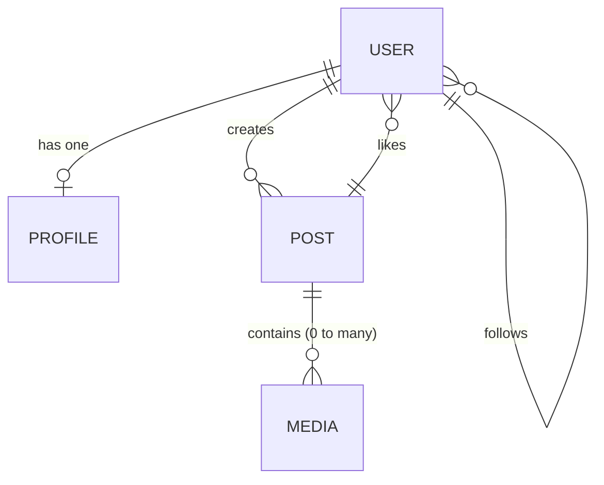

# Exercise 1 - RDB

1. Set up a SQL DB
2. Create a schema for social network (user, post, profile, photos, following)
3. Insert data (in user and profile) in one transaction


## Setup

Install postgresql helm 

```sh
helm install my-release oci://registry-1.docker.io/bitnamicharts/postgresql
```

To execute PSQL commands

```sh
export POSTGRES_PASSWORD=$(kubectl get secret --namespace default my-release-postgresql -o jsonpath="{.data.postgres-password}" | base64 -d)
kubectl run my-release-postgresql-client --rm --tty -i --restart='Never' --namespace default --image registry-1.docker.io/bitnami/postgresql:latest --env="PGPASSWORD=$POSTGRES_PASSWORD" \
      --command -- psql --host my-release-postgresql -U postgres -d postgres -p 5432
```

## Schema Design

A user have a profile
A user can create post
A user can follow another user
A user can like a post
A post can contain 1 to many media (images, videos, audios) and text

