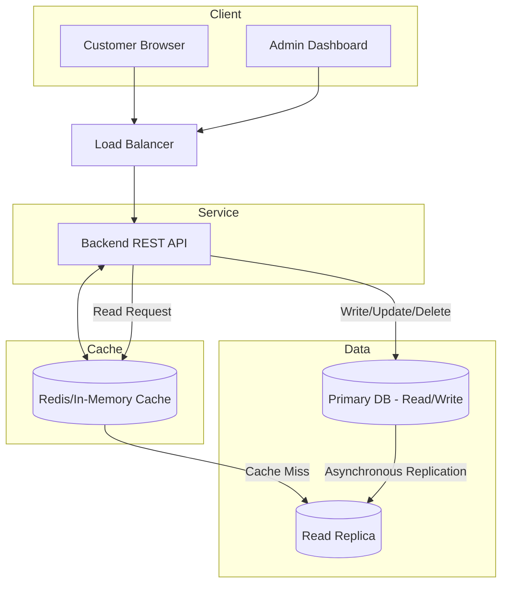

# Exercise 11 - Designing E-commerce product listing

This exercise setup a CNPG database with local Rust app accessing the database via port-forwarding.

## Description

For a small shop of 100 items, design a system in which the shop owner can

- add a new product
- update/delete existing product
- list all products on the website
- customers should be able to access catalog quickly

Task

- Design DB schema
- Write backend API
- Setup DB replication
- Read API from replica

## Design

### Architecture 

Classic 3 tier architecture: Client -> Server -> DB



#### Storage

- Small, only 100 rows
- Structured data -> RDB
- Read replicas to handle read

#### Services

- One frontend for client, another for admin and a backend
- REST HTTP
- Scalable
- Frontend by load balancer

#### Cache

- Cache layer before DB 

### Database

#### Schema

```sql
CREATE TABLE categories (
    id SERIAL PRIMARY KEY,
    name VARCHAR(100) UNIQUE NOT NULL,
    created_at TIMESTAMP DEFAULT CURRENT_TIMESTAMP
);

CREATE TABLE products (
    id SERIAL PRIMARY KEY,
    name VARCHAR(255) NOT NULL,
    description TEXT,
    category_id INTEGER REFERENCES categories(id) ON DELETE SET NULL, -- foreign key on category, if catogory is deleted, set to null
    created_at TIMESTAMP DEFAULT CURRENT_TIMESTAMP
);

CREATE INDEX idx_products_category_id ON products(category_id); -- postgres does not automatically index foreign keys

CREATE TABLE product_variants(
    id SERIAL PRIMARY KEY,
    product_id INTEGER NOT NULL REFERENCES products(id) ON DELETE CASCADE, -- foreign key on product, if product is delete, delete all variant
    sku VARCHAR(100) UNIQUE NOT NULL,
    attributes JSONB NOT NULL,
    price DECIMAL(10, 2) NOT NULL,
    stock_quantity INTEGER DEFAULT 0,
    created_at TIMESTAMP DEFAULT CURRENT_TIMESTAMP
);

CREATE INDEX idx_variants_attributes ON product_variants USING GIN (attributes); -- index on json using GIN to filter attribute 
```

#### Sample data and query

```sql
INSERT INTO categories (name) VALUES 
('Electronics'), 
('Apparel');

INSERT INTO products (name, description, category_id) VALUES
('SuperPhone 13', 'A high-end smartphone', 1),
('DevLaptop Pro', 'Powerful laptop for devs', 1),
('Organic Cotton T-Shirt', 'Soft and sustainable', 2);

INSERT INTO product_variants (product_id, sku, attributes, price, stock_quantity) VALUES
(1, 'SP13-RED-128', '{"color": "Red", "storage": "128GB", "type": "OLED"}', 799.99, 50),
(2, 'LAP-GRY-16', '{"color": "Space Gray", "ram": "16GB", "cpu": "M2"}', 1299.00, 20),
(3, 'TSHIRT-RED-L', '{"color": "Red", "size": "L", "material": "Cotton"}', 25.00, 100);

-- Query by category
SELECT 
    p.name AS product_name, 
    c.name AS category_name, 
    pv.price, 
    pv.stock_quantity AS quantity
FROM products p
JOIN categories c ON p.category_id = c.id
JOIN product_variants pv ON pv.product_id = p.id
WHERE p.category_id = 1;

-- Query by Attribute
-- Using the "Contains" operator (@>) which is powered by a GIN index
SELECT 
    p.name AS product_name, 
    pv.sku, 
    pv.price, 
    pv.stock_quantity AS quantity,
    pv.attributes->>'color' AS color
FROM product_variants pv
JOIN products p ON pv.product_id = p.id
WHERE pv.attributes @> '{"color": "Red"}';
```

## Setup

```sh
# use server-side as the entire state of the object in a "last-applied-configuration" annotation is too big
kubectl apply --server-side -f https://raw.githubusercontent.com/cloudnative-pg/cloudnative-pg/main/releases/cnpg-1.28.0.yaml

# wait for cnpg controller to be runnng
kubectl get pod -n cnpg-system --watch

# create a db instance with 2 replca
cat <<EOF | kubectl apply -f -
apiVersion: postgresql.cnpg.io/v1
kind: Cluster
metadata:
  name: my-ecommerce-db
spec:
  instances: 2
  storage:
    size: 1Gi
EOF
```

Run a SQL client and execute the SQL commands from the above section.

```sh
export POSTGRES_PASSWORD=$(kubectl get secret my-ecommerce-db-app -o jsonpath="{.data.password}" | base64 -d)
kubectl run postgresql-client --rm --tty -i --restart='Never' --image registry-1.docker.io/bitnami/postgresql:latest --env="PGPASSWORD=$POSTGRES_PASSWORD" \
      --command -- psql --host my-ecommerce-db-rw  -U app -d app -p 5432
```

Port-forward to allow accessing the db from local

```sh
kubectl port-forward svc/my-ecommerce-db-rw 5432:5432
```

## Test

```sh
# Create product and capture the ID
NEW_ID=$(curl -s -X POST http://localhost:3000/products \
  -H "Content-Type: application/json" \
  -d '{
    "name": "Mechanical Keyboard",
    "description": "RGB Backlit, Blue Switches",
    "category_id": 1,
    "sku": "KB-RGB-02",
    "price": 89.99,
    "attributes": {
      "color": "Black",
      "switch": "Tactile Blue",
      "layout": "US"
    }
  }' | jq '.id')

# List all products
curl -s -X GET http://localhost:3000/products | jq

# Fetch by ID
curl -s -X GET http://localhost:3000/products/${NEW_ID} | jq

# Update name
curl -X PUT http://localhost:3000/products/${NEW_ID} \
  -H "Content-Type: application/json" \
  -d '{"name": "Ultra-Wide Mechanical Keyboard"}'

# Verify the change
curl -s -X GET http://localhost:3000/products/${NEW_ID} | jq

# Delete product
curl -X DELETE http://localhost:3000/products/${NEW_ID}

# Verify product deleted 
curl -s -X GET http://localhost:3000/products | jq
```

## Cleanup

```sh
kubectl delete cluster my-ecommerce-db
kubectl get pvc | grep 'my-ecommerce-db' | awk '{print $1}' | xargs kubectl delete pvc 
helm uninstall pgdb
kubectl delete -f https://raw.githubusercontent.com/cloudnative-pg/cloudnative-pg/main/releases/cnpg-1.28.0.yaml
```