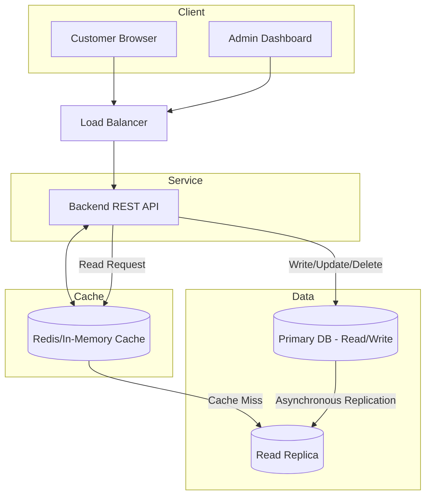

# Exercise 11 - Designing E-commerce product listing

For a small shop of 100 items, design a system in which the shop owner can

- add a new product
- update/delete existing product
- list all products on the website
- customers should be able to access catalog quickly

Task

- Design DB schema
- Write backend API
- Setup DB replication
- Read API from replica

## Design

### Architecture 

Classic 3 tier architecture: Client -> Server -> DB

#### Storage

- Small, only 100 rows
- Structured data -> RDB
- Read replicas to handle read

#### Services

- One frontend for client, another for admin and a backend
- REST HTTP
- Scalable
- Frontend by load balancer

#### Cache

- Cache layer before DB 

