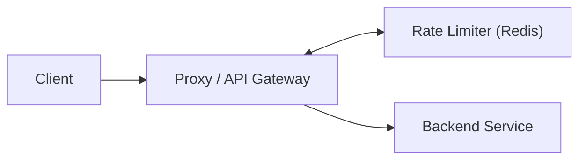
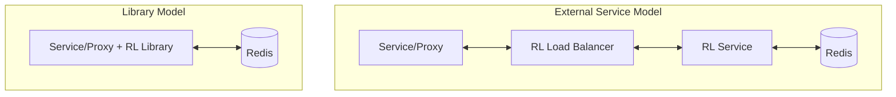

# Exercise 12 - Rate Limiting with Redis

Implement rate limiting strategies (fixed window, sliding window) using Redis and Rust.

**Objectives**:
1. Deploy Redis on Kubernetes via Helm
2. Implement fixed window and sliding window rate limiting algorithms
3. Build Rust (Axum) server with selectable rate limiting strategies
4. Test rate limiting behavior with configurable limits and windows

## Context

### Architecture Design

Rate limit primary works with heavy writes (per request) and require low-latency. Redis is the gold standard for implementing rate limit as request are usually stored with a unique identify (eg, user_id) and an count. 

#### Option 1: Proxy

In this model, an API Gateway or Reverse Proxy (e.g., Nginx, Kong) sits in front of the services. It intercepts requests and consults the Rate Limiter before forwarding traffic.

Trade-offs:

- Pros: Stops malicious traffic at the "edge" before it hits the internal network; centralized management of global limits.
- Cons: The proxy is "context-blind"—it usually can't see specific user data hidden in encrypted payloads or complex business rules.



Option 2: Load Balancer

Traffic is distributed by a Load Balancer (LB) directly to the application services. The service itself initiates the rate-limiting check.

Trade-offs:

- Pros: Allows for "context-aware" limiting based on user identity, subscription tier, or the "cost" of specific database operations.
- Cons: The service must spend CPU cycles processing the initial request; does not protect the service from being overwhelmed by a massive DDoS attack.


In either option, the rate-limiting logic can be implemented in two ways:

1. The "Service" Approach

The Rate Limiter is a standalone microservice with its own Load Balancer, hitting a Redis backend.

Trade-offs:

- Pros: Language-agnostic (any service can call it via HTTP/gRPC); independent scaling.
- Cons: Introduces additional network hops and latency; adds infrastructure complexity.

2. The "Library" Approach

The rate-limiting logic is a library (SDK) integrated directly into the Proxy or Service code.

Trade-offs:

- Pros: High performance with minimal latency; fewer moving parts to manage.
- Cons: Must be re-implemented or ported for every different programming language used in the stack; updates require a re-deployment of the entire service.



### Storage

Assuming key-value pair of 20 Bytes each and 100m requires, this will only take 2GB.

### Rate Limiter Strategy

Fixed Window: Resets a simple counter at set intervals (e.g., every 60s), making it easy to implement but prone to "bursts" at the window boundaries.

Leaky Bucket: Forces a steady flow of traffic by requiring a minimum time gap between requests, effectively smoothing out jagged spikes.

Sliding Window: Uses a moving 10-second look-back from the current microsecond to provide the most precise and fair enforcement possible.


## Setup

Install RedisStack.

```sh
helm repo add redis-stack https://redis-stack.github.io/helm-redis-stack/
helm install redis redis-stack/redis-stack
```

Port-forward to Redis.

```sh
kubectl port-forward service/redis-stack 6379:6379
```

## Rust Code

`resources/ex-12/src/main.rs` demonstrate how to build a high-performance Rate Limiting Service using Rust and Axum. The service acts as a "gatekeeper" for API, ensuring users stay within defined request limits to prevent abuse and server overload.

Core Highlights

- Three Strategic Algorithms: 
  - Fixed Window
  - Leaky Bucket (GCRA)
  - Sliding Window strategies

Atomic Redis Operations: Uses Lua scripting to offload logic to the Redis server. This ensures that the "check-and-increment" operations are atomic, preventing race conditions even under extreme concurrency.

High-Resolution Precision: Leverages Redis TIME (microsecond precision) to handle high-frequency bursts, ensuring that multiple requests hitting within the same millisecond are all tracked accurately.

Modern Rust Concurrency: Built on the Tokio runtime with a Multiplexed Redis Connection, allowing thousands of concurrent users to share a single, efficient TCP pipeline.

It adopt a strategy pattern and the configuration is pass in via args.

```rust
enum Strategy { Fixed, Leaky, Sliding }

let cfg = AppConfig {
    redis_url: "redis://127.0.0.1/".into(),
    strategy,
    limit,
    window_secs: window,
};
```

```sh
# Format: cargo run -- <strategy> <limit> <window_secs>
cargo run -- fixed 3 10
```

## Test

The strategy, limits and window can be configured

```sh
# Format: cargo run -- <strategy> <limit> <window_secs>
cargo run -- fixed 3 10
```

Unified test script
```sh
i=0; SECONDS=0; for s in 0 4 4 2 1 1 1 2; do sleep $s; curl -s -o /dev/null -w "R$((++i)) (${SECONDS}s) $(date +%T): %{http_code}\n" http://localhost:3000/api/user; done
```
### Fixed Window

Logic: Resets the entire quota at fixed 10-second intervals.

Why R4-R6 pass: The window likely reset at the 10s mark, granting a fresh "3-request" budget.

Why R7-R8 fail: These exceeded the new 10s budget immediately.

```sh
# output
R1 (0s) 17:11:03: 200
R2 (4s) 17:11:07: 200
R3 (8s) 17:11:11: 200
R4 (10s) 17:11:13: 200
R5 (11s) 17:11:14: 200
R6 (12s) 17:11:15: 200
R7 (13s) 17:11:16: 429
R8 (15s) 17:11:18: 429
```

## Sliding Window

Logic: Looks back exactly 10 seconds from the current microsecond.

Why R5-R7 fail: Even though time passed, R2 and R3 are still inside the "10-second lookback."

Why R8 passes: Finally, enough time has passed for the earlier requests to "slide" out of the window.

# output
```sh
R1 (0s) 17:11:41: 200
R2 (4s) 17:11:45: 200
R3 (8s) 17:11:49: 200
R4 (10s) 17:11:51: 200
R5 (11s) 17:11:52: 429
R6 (12s) 17:11:53: 429
R7 (13s) 17:11:54: 429
R8 (15s) 17:11:56: 200
```

## Leaky

Logic: Smooths out traffic by allowing requests to "leak" at a rate of 1 per 3.33s.

Why R4-R6 pass: Because you waited 8 seconds before R3, the bucket had already leaked space for more. It allows a "burst" of 3, but then requires a cooldown.

Why R7 fails: The bucket is overflowed; it hasn't had the ~3.3s required to leak a single spot since R6.

```sh
# Output
R1 (0s) 17:12:12: 200
R2 (4s) 17:12:16: 200
R3 (8s) 17:12:20: 200
R4 (10s) 17:12:22: 200
R5 (11s) 17:12:23: 200
R6 (12s) 17:12:24: 200
R7 (13s) 17:12:25: 429
R8 (15s) 17:12:27: 200
```

## Cleanup

```sh
helm uninstall redis
```
