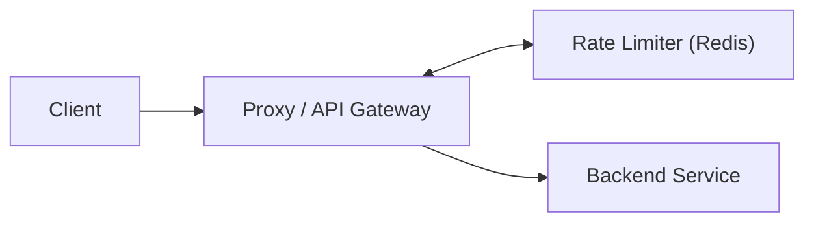
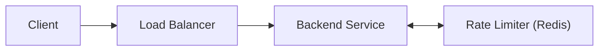
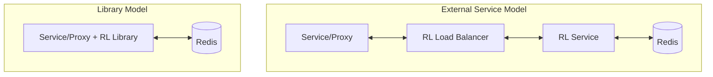

# Exercise 11 - Designing E-commerce product listing

This exercise setup a CNPG database with local Rust app accessing the database via port-forwarding.

## Description

Design a rate limiter 

## Design

Rate limit primary works with heavy writes (per request) and require low-latency. Redis is the gold standard for implementing rate limit as request are usually stored with a unique identify (eg, user_id) and an count. 

### Architecture 

Option 1: Proxy

Client -> Proxy
Proxy -> Rate Limiter
Proxy -> Service

Option 2: Load Balancer

Client -> LB
LB -> Service
Service -> Rate Limiter

In either option, the Rate Limiter can be implemented as a service or library.

As a service can be fronted with its own Load Balancer, Service hitting Redis. This allow the proxy/backend to be view the rate limiter external.
However this adds additional complexity and network hops.
The other way is to make the rate limiter a library as part of the proxy and service.

#### Storage

Assuming key-value pair of 20 Bytes each and 100m requires, this will only take 2GB.
