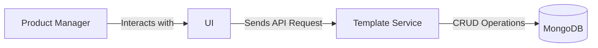
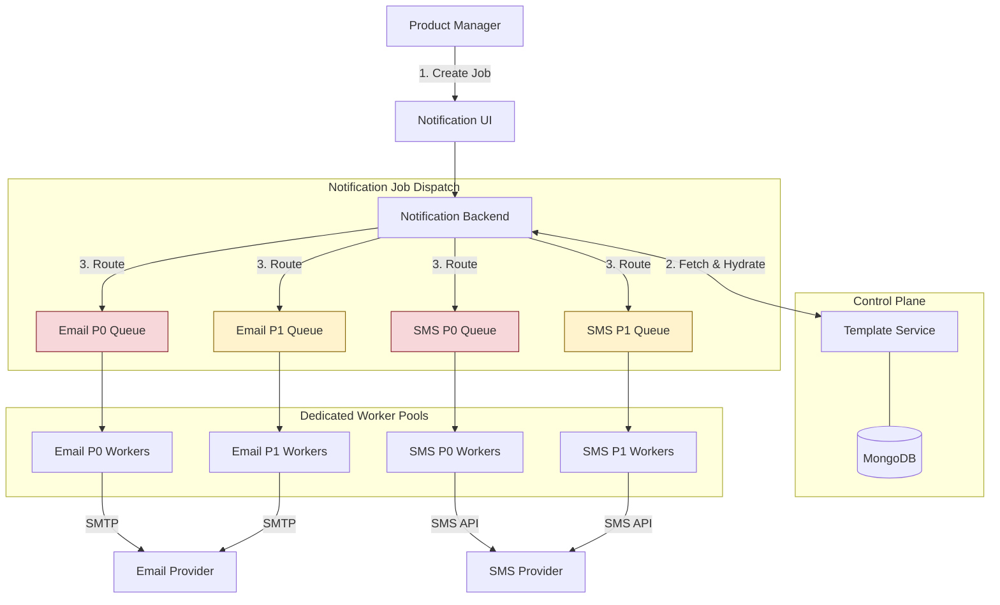
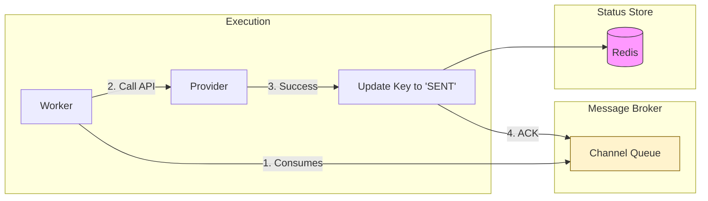
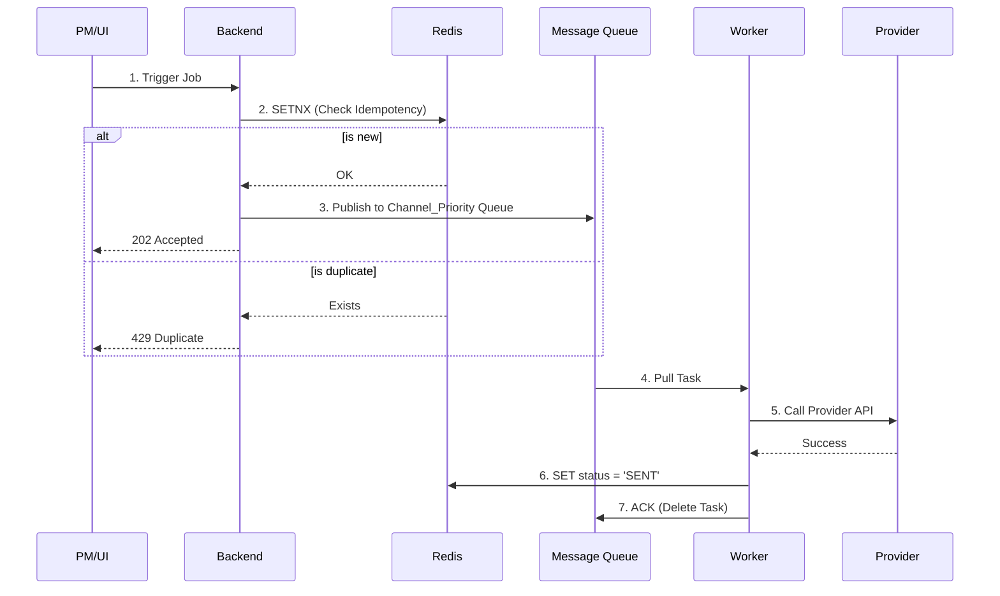

# Exercise 13 - Notification Service Design (RFC)

Design a high-availability, multi-channel notification system supporting Email, SMS, and Push notifications.

**Objectives**:
1. Design asynchronous architecture with fan-out pattern for multiple channels
2. Ensure idempotency and exactly-once delivery semantics
3. Support priority-based routing with dedicated worker pools
4. Enable horizontal scaling based on queue depth

**Note**: This is a design-only exercise with no implementation.

## Context

### Problem Statement

The objective is to architect a high-availability, low-latency notification system capable of multi-channel delivery (Email, SMS, Push). The design focuses on asynchronous processing and idempotency to manage traffic spikes effectively while protecting downstream third-party vendors from exhaustion.

### Functional Requirements

- Template Management: Product Managers (PMs) must be able to create and manage dynamic templates via a dashboard.
- Multi-Channel Support: A single event can trigger notifications across multiple channels simultaneously (e.g., Push + Email).
- Categorization: Support for various message types, such as high-urgency transactional alerts (OTPs) and bulk marketing campaigns.

Non functional requirements:

- Exactly-once Semantics: Ensure users do not receive duplicate notifications for a single event.
- Extensibility: The architecture must allow for the seamless addition of new channels (e.g., Slack, WhatsApp).
- Scalability: The system must handle spiky workloads, scaling workers horizontally based on queue depth.

## Design

### Notification Template Engine

To allow for rapid content iteration without code changes, PMs use a dedicated UI to perform CRUD operations on templates.

- Storage: MongoDB is used as the metadata store. Its document-oriented nature easily accommodates semi-structured templates that vary significantly between channels (e.g., HTML for Email vs. plain text for SMS).
- Performance: Read-heavy workloads are mitigated by the low frequency of template updates, making this service highly stable.



### Notification Channels

To ensure high availability and prevent cascading failures, the system adopts an Asynchronous Fan-Out architecture.

1. Job Creation: The PM initiates a job via the UI, defining the audience, channels, and priority ($P_0$, $P_1$, $P_2$).
2. Template Hydration: The Notification Backend fetches the template and merges it with user data.
3. Channel-Specific Fan-Out: The Backend splits a single "Job" into individual "Tasks" per channel.
4. Matrix Routing: Tasks are published to specific queues (e.g., Email_P0, SMS_P1).
5. Dedicated Execution: Specialized worker pools subscribe to specific channel-priority pairs, ensuring marketing blasts never delay an OTP.




### Notification tracker

Redis is used as a high-performance, distributed state store to prevent duplicates and provide delivery visibility.

- The system uses a single Redis key per notification to act as both a duplicate-preventer and a progress indicator.
- Key Format: notif:{{event_id}}:{{user_id}}:{{channel}}
- The Logic:
  - Backend: Performs a SETNX. If successful, sets the value to ENQUEUED.
  - Worker: Once the message is picked up and successfully sent to the provider, the worker updates that same key to SENT.
- TTL (Time-to-Live): The key expires after 24 hours. This provides a window to prevent duplicates and allows the PM to query the status of recent notifications.



## Schema Design

### Notification Template

```json
{
  "template_id": "welcome_email_001",
  "event_name": "user_onboarding",
  "version": "1.2.0",
  "channels": {
    "email": {
      "subject": "Welcome to the team, {{user_name}}!",
      "body_html": "<html>...</html>",
      "sender": "onboarding@company.com"
    },
    "sms": {
      "body": "Hi {{user_name}}, thanks for joining! Use code {{code}} to get started."
    },
    "push": {
      "title": "Welcome aboard!",
      "message": "Tap here to complete your profile.",
      "deep_link": "app://profile/setup"
    }
  },
  "created_at": "2024-05-20T10:00:00Z",
  "updated_by": "admin_user_42"
}
```

### Redis Key

The Backend generates a unique key for every potential notification using the pattern notif:{{event_id}}:{{user_id}}:{{channel}}. Before any processing occurs, the Backend executes a SETNX (Set if Not Exists) operation.

Atomic Locking: Because SETNX is atomic, it acts as a gatekeeper. If the command returns 1, the Backend has successfully claimed the "lock" and proceeds to hydrate the template and enqueue the job.

Conflict Resolution: If the command returns 0, the system identifies the request as a duplicate and immediately rejects it with a 429 Too Many Requests or 200 OK (depending on the desired API behavior), preventing redundant downstream load.


### System Overview 



## Appendix

### Alternative Considered

1. Unified Queue with Selective Worker Execution
The Alternative: All notification tasks are published to a single, global queue. Specialized worker pools then filter messages based on channel metadata.

Reason for Rejection: This approach introduces a "Noisy Neighbor" risk. A high-volume marketing campaign could saturate the queue, causing latency for time-sensitive transactional alerts like OTPs. Retries logic could get complicated in the event that partial provider succeed.

2. Synchronous Provider Integration
The Alternative: The Backend initiates direct API calls to third-party providers and waits for a response before acknowledging the client request.

Reason for Rejection: External API latency is variable and outside system control. Synchronous integration couples system availability to provider performance, leading to potential thread exhaustion during provider outages or traffic spikes. Asynchronous processing via message brokers decouples the service from external dependencies.

3. Distributed Transactions (2PC) for Redis and Message Broker
The Alternative: The implementation of a Two-Phase Commit to ensure atomic updates between the Redis idempotency state and the Message Queue.

Reason for Rejection: Distributed transactions introduce significant overhead and decrease system throughput. The current design utilizes a pragmatic idempotency pattern: a Redis key with a short TTL. This allows for eventual consistency where a failed publish can be safely retried by the client after the TTL expires, avoiding the complexity of 2PC.

4. Relational Database for Status Tracking
The Alternative: Utilization of a traditional RDBMS (e.g., PostgreSQL) to record and update the lifecycle of every notification.

Reason for Rejection: High-frequency status updates at scale generate excessive write-IOPS on relational databases, necessitating complex vacuuming and partitioning strategies. Redis provides sub-millisecond latency for high-throughput writes and simplifies memory management through native TTL-based expiration.
