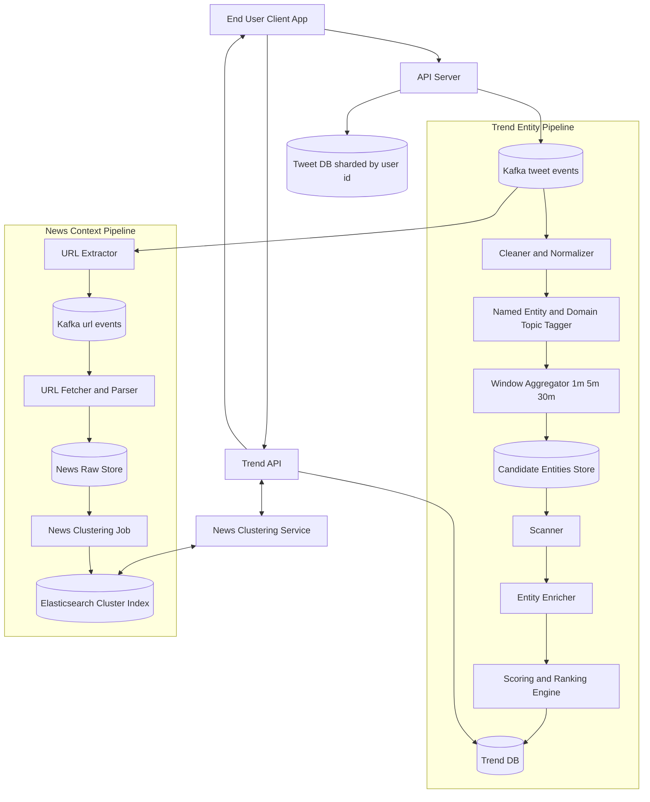
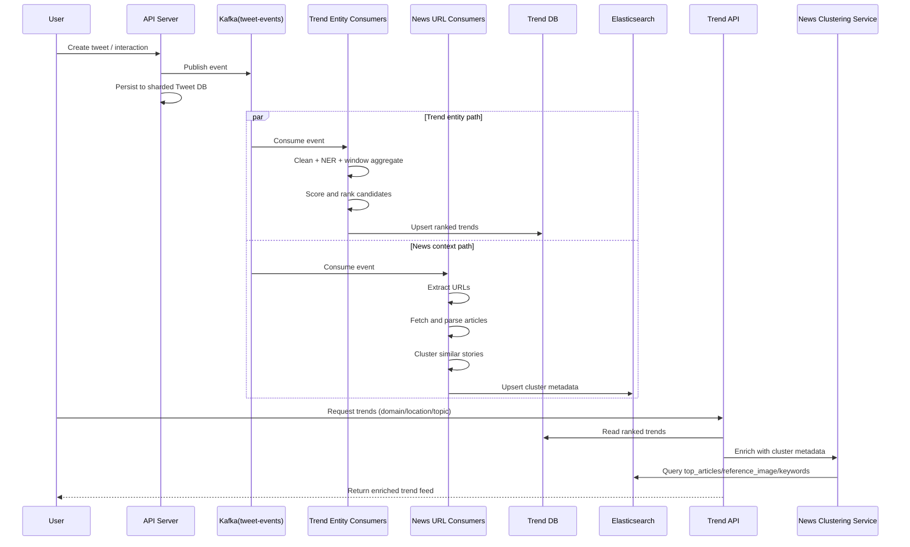
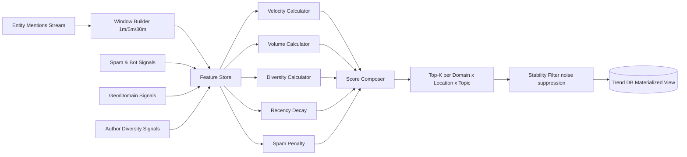

# Exercise 16 - Twitter Trends & News Clustering System Design

Design a near real-time trend system that identifies what is currently happening, enriches it with clustered news context, and serves ranked trends to end users.

**Objectives**:
1. Design a streaming pipeline for trend detection with low-latency updates
2. Build an enrichment pipeline for URLs/news clustering and metadata extraction
3. Compute trend candidates by domain, location, and topic with time-window aggregation
4. Rank and serve trends through a read-optimized API path
5. Explain trade-offs between freshness, quality, and system cost

## Context

“Trending” is time-sensitive: high-quality ranking requires both velocity (what is rising now) and quality signals (what the topic actually refers to).

This exercise combines two parallel streams:
- **Entity Trend Stream**: Extract entities from tweets and score them by time window.
- **News Context Stream**: Extract URLs from tweets, fetch linked pages, cluster related stories, and attach representative metadata.

Why this design:
- A single hot write path (`API -> Kafka`) keeps ingestion fast and resilient.
- Separate consumers let us scale extraction, enrichment, and ranking independently.
- Read-side stores are specialized for query patterns: ranking lookup vs search/cluster metadata.

## Design

### Key Subsystems

1. **Ingestion Path**
   - Client posts tweet/event to API.
   - API writes raw events to Kafka.
   - API also persists tweet records in sharded Tweet DB (`user_id` shard key).

2. **Trend Candidate Pipeline**
   - Clean/filter text.
   - Perform Named Entity Recognition (NER) and domain/topic tagging.
   - Aggregate candidate entities by time windows (e.g., 1m, 5m, 30m).
   - Score and rank with recency + velocity + diversity signals.

3. **News Clustering Pipeline**
   - Extract URLs from Kafka events.
   - Fetch article content + metadata.
   - Cluster similar stories.
   - Publish cluster metadata (`top_articles`, `reference_image`, `keywords`) into Elasticsearch.

4. **Serving Path**
   - Trend API reads ranked entities from Trend DB.
   - Trend API calls News Clustering Service for enriched context.
   - End users receive ranked trends with meaningful story summaries.

### Full System Architecture

### End-to-End Data Flow

### Ranking Notes (Example)

A practical ranking signal can be modeled as:

$$
score(e) = \alpha \cdot velocity(e) + \beta \cdot volume(e) + \gamma \cdot diversity(e) + \delta \cdot recency(e) - \lambda \cdot spam(e)
$$

Where `velocity` captures growth in short windows and `diversity` penalizes single-source amplification.

### Ranking Engine Internals (Detailed)

### News Clustering Internals (Detailed)

```mermaid
flowchart LR
	UEV[URL Events Stream] --> CAN[URL Canonicalizer remove tracking params]
	CAN --> DEDUP[Deduplicator]
	DEDUP --> FETCH[Content Fetcher]
	FETCH --> PARSE[Article Parser title/body/published_at]
	PARSE --> LANG[Language + Quality Filter]
	LANG --> EMB[Embedding / TF-IDF Vectorizer]

	EMB --> CLUS[Clustering Engine DBSCAN/HDBSCAN]
	CLUS --> LABEL[Cluster Labeler keywords + headline]
	LABEL --> IMG[Reference Image Selector]
	IMG --> META[(Cluster Metadata Store)]

	META --> IDX[Elasticsearch Cluster Index]
	IDX --> NCS[News Clustering Service]
```

## Setup

No deployment required. This is a design-only exercise.

## Test

Validate the design against these scenarios:
1. **Breaking event spike**: sudden global growth in one topic
2. **Regional divergence**: same topic trending in one location but not another
3. **Spam burst**: repeated low-quality mentions from coordinated actors
4. **News mismatch**: trend entity exists but no strong cluster metadata yet

Expected outcomes:
- Trend ranking remains fresh and stable across windows.
- Enrichment degrades gracefully when clusters are unavailable.
- Serving API stays responsive under ingestion spikes.

## Cleanup

No teardown required (no infrastructure provisioned).

## References / Appendix

- [Apache Kafka Documentation](https://kafka.apache.org/documentation/)
- [Elasticsearch Guide](https://www.elastic.co/guide/en/elasticsearch/reference/current/index.html)
- [Named Entity Recognition Overview](https://en.wikipedia.org/wiki/Named-entity_recognition)
- [DBSCAN Clustering](https://scikit-learn.org/stable/modules/generated/sklearn.cluster.DBSCAN.html)
- [HDBSCAN Documentation](https://hdbscan.readthedocs.io/en/latest/)