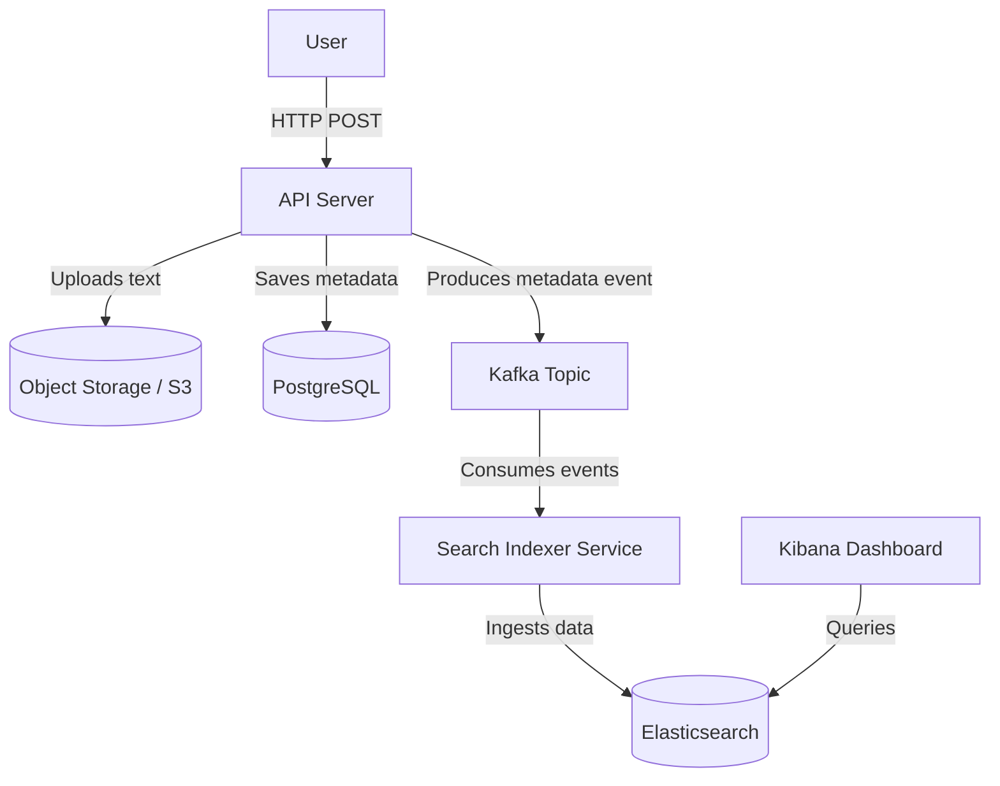
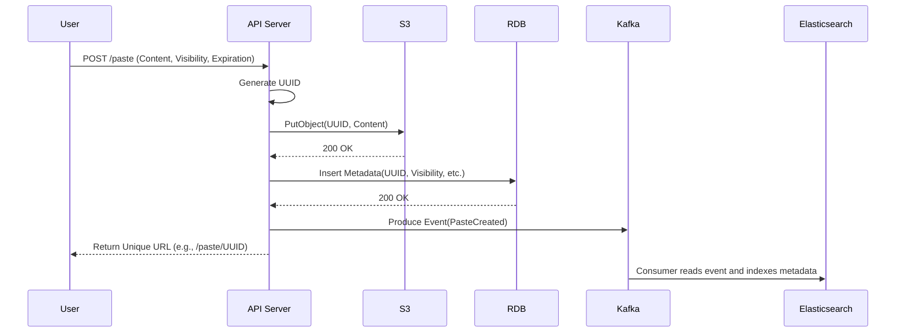

# Exercise 18 - Design Pastebin

## Objectives
1. Understand the system design of a Pastebin service.
2. Design an architecture for storing, retrieving, and analyzing text snippets.
3. Deploy Elasticsearch and Kibana locally using Kubernetes (Minikube).
4. Ingest mock Pastebin metadata into Elasticsearch and create visualizations in Kibana.

## Context
Pastebin is a popular service that allows users to upload plain text or code snippets, generating a unique URL for sharing. The core features include:
- Storing text files (typically < 10 MB).
- Sharing capabilities (public, unlisted, or private).
- Expiration settings for auto-deletion.
- Ability for the original author to edit their pastes.

In this exercise, we will explore the architectural design for such a service. While the actual text content would be stored in an object store like S3 due to the high volume (e.g., 100 TB/month for 10M writes at 10 MB each), we need a robust solution for full-text search and metadata analytics. We will use **Elasticsearch** as our search engine and **Kibana** as our visualization dashboard to analyze paste metadata.

## Design

### Capacity & Storage
- **Traffic**: Assuming 10 million writes per month, with a maximum file size of 10 MB.
- **Storage**: ~100 TB of raw text data generated per month.
- **Datastore**: 
  - **Content**: Object Storage (e.g., AWS S3) is ideal for storing the raw text blobs continuously.
  - **Metadata**: A Relational Database (RDB) like PostgreSQL is suitable for ACID-compliant metadata storage.
  - **Caching**: Due to the long-tail nature of pastes (most pastes are rarely read after the first few days), a cache may result in a low hit rate and isn't strictly necessary for the MVP.
  - **Search**: Elasticsearch to index metadata (and optionally the text itself) for fast querying and analytics.

**Metadata Schema (PostgreSQL)**
- `uid` (UUID, Primary Key)
- `name` (String)
- `createdAt` (Timestamp)
- `visibility` (Enum: Public, Private, Unlisted)
- `owner_id` (String / UUID)
- `expiration` (Timestamp)

### Architecture Flow





## Setup

We will deploy Elasticsearch and Kibana using Helm on our Minikube cluster.

1. **Add the Elastic Helm Repository**:
```bash
helm repo add elastic https://helm.elastic.co
helm repo update
```

2. **Deploy Elasticsearch**:
We deploy a single-node Elasticsearch cluster for local testing.
```bash
helm install elasticsearch elastic/elasticsearch \
  --set replicas=1 \
  --set minimumMasterNodes=1 \
  --set resources.requests.cpu=500m \
  --set resources.requests.memory=1Gi \
  --set resources.limits.cpu=1000m \
  --set resources.limits.memory=2Gi
```

3. **Deploy Kibana**:
```bash
helm install kibana elastic/kibana \
  --set resources.requests.cpu=500m \
  --set resources.requests.memory=1Gi \
  --set resources.limits.cpu=1000m \
  --set resources.limits.memory=2Gi
```

4. **Wait for Pods to be Ready**:
```bash
kubectl get pods --watch
```
*(Wait until both `elasticsearch-master-0` and `kibana-kibana-*` are in the `Running` state.)*

5. **Port-Forward to Access Kibana and Elasticsearch**:

In one terminal, forward Kibana (runs on 5601):
```bash
kubectl port-forward svc/kibana-kibana 5601:5601
```

In another terminal, forward Elasticsearch (runs on 9200):
```bash
kubectl port-forward svc/elasticsearch-master 9200:9200
```

## Test

1. **Verify Elasticsearch is Running**:
```bash
curl -X GET "localhost:9200/"
```

2. **Mock Pastebin Data Ingestion**:
Let's populate Elasticsearch with some mock metadata representing different pastes.

```bash
curl -X POST "localhost:9200/pastes/_bulk?pretty" -H 'Content-Type: application/json' -d'
{ "index": { "_id": "1" } }
{ "uid": "abc-123", "name": "Python Script", "visibility": "public", "owner_id": "user1", "language": "python", "size_kb": 12 }
{ "index": { "_id": "2" } }
{ "uid": "def-456", "name": "React Component", "visibility": "public", "owner_id": "user2", "language": "javascript", "size_kb": 8 }
{ "index": { "_id": "3" } }
{ "uid": "ghi-789", "name": "Personal Notes", "visibility": "private", "owner_id": "user1", "language": "text", "size_kb": 2 }
{ "index": { "_id": "4" } }
{ "uid": "jkl-012", "name": "Rust Server", "visibility": "public", "owner_id": "user3", "language": "rust", "size_kb": 25 }
{ "index": { "_id": "5" } }
{ "uid": "mno-345", "name": "DB Migration", "visibility": "unlisted", "owner_id": "user2", "language": "sql", "size_kb": 45 }
'
```

3. **Visualize in Kibana**:
- Open Kibana in your browser: `http://localhost:5601`
- Navigate to **Management > Stack Management > Data Views**.
- Create a Data View matching the pattern `pastes*` and select the appropriate timestamp field if instructed (or proceed without one).
- Navigate to **Analytics > Discover** to see your mock data.
- Go to **Analytics > Dashboard** and create simple visualizations (e.g., a pie chart showing the distribution of `language.keyword` or `visibility.keyword`).

## Cleanup

It is essential to clean up the cluster to free up resources for other exercises.

1. **Uninstall Helm Releases**:
```bash
helm uninstall kibana
helm uninstall elasticsearch
```

2. **Delete Persistent Volume Claims (PVCs)**:
Elasticsearch creates PVCs that must be removed manually.
```bash
kubectl delete pvc -l app=elasticsearch-master
```

## References / Appendix
- [Elasticsearch Helm Chart Documentation](https://github.com/elastic/helm-charts/tree/main/elasticsearch)
- [Kibana Helm Chart Documentation](https://github.com/elastic/helm-charts/tree/main/kibana)
- [Elasticsearch Bulk API](https://www.elastic.co/guide/en/elasticsearch/reference/current/docs-bulk.html)

