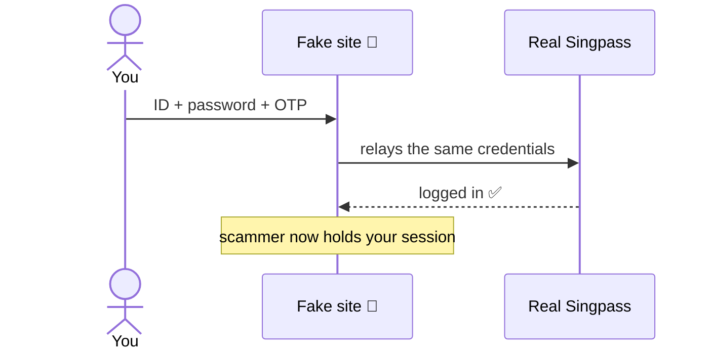
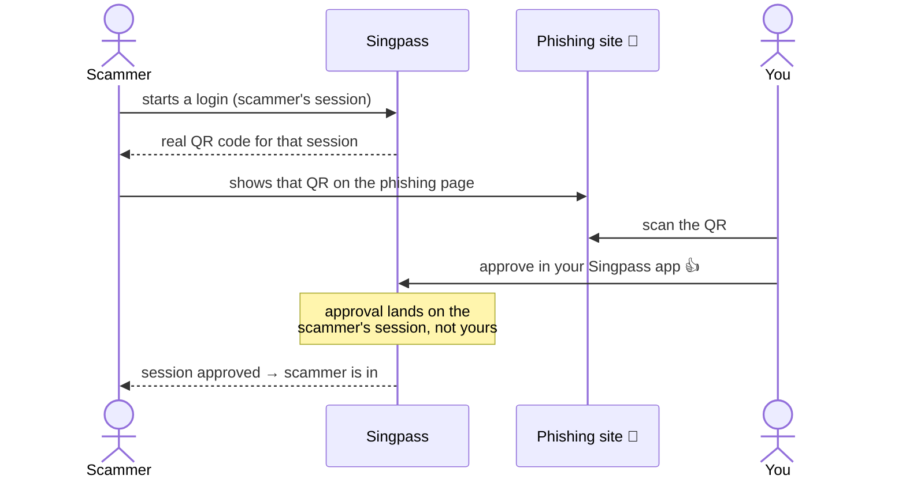
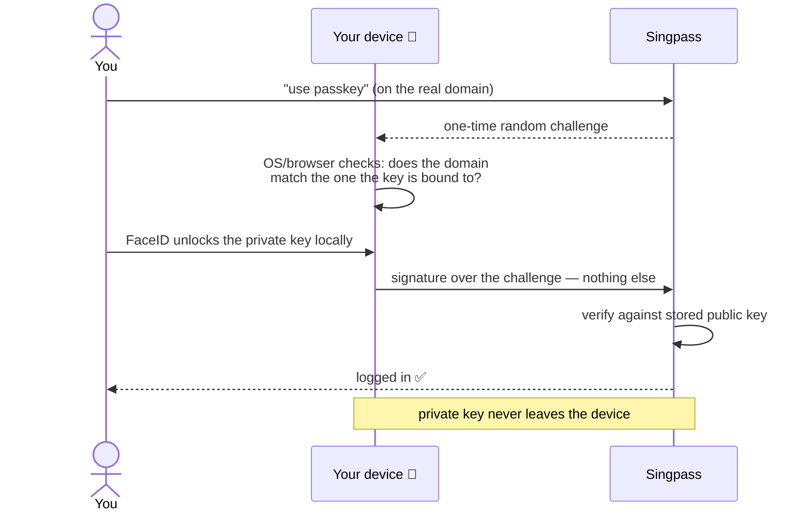
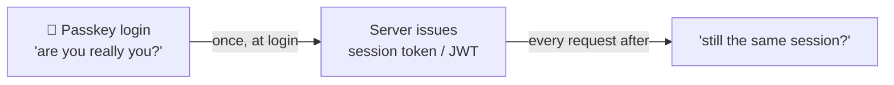

# Poking at cyber basics: Singpass Passkey

(5–10 minutes read)

Random sharing from poking at some cyber basics. Singpass recently rolled out passkeys (iPhone first, in beta). We all "know" passkeys are better — this is just me digging back into why at ground level.

---

The UX is basically identical to before: get routed to Singpass → FaceID → approve. So the interesting part isn't the experience, it's what happens underneath.

## The two old attacks (and why they work)

**Attack 1: typed credentials — the phishing relay.** Easy to picture: you land on a fake page, type ID + password + OTP, and the fake page relays them to the real Singpass in real time. The scammer walks in with your credentials.

**Attack 2: QR login — you approve the scammer's session.** This one confused me, so I dug in. Here the scammer steals a *session*, not credentials:

Nothing secret leaks. The flaw is that your approval isn't tied to *which* session you're approving — you assumed it was yours, but it was theirs.

## How passkeys fix it

The fundamental change: **the private key is bound to the real Singpass domain, and domain validation is done by your device, not your eyeballs.**

- At onboarding, the private key stays on your device; Singpass holds only the matching public key.
- There's no QR code in the passkey flow (QR login still exists as a legacy option, but passkey doesn't use it — so there's no detached session to approve).

On a fake domain, the flow dies at the domain check — your device simply won't offer the passkey.

## Why this is better

1. **Phishing blocked by design.** The passkey only responds to the real domain, so a fake page gets nothing. No more relying on users to eyeball the URL.
2. **Nothing reusable crosses the wire.** The signature answers one specific random challenge and is useless afterward — no credential to relay, no session to hijack. Asymmetric crypto (sign / verify) replaces sending a reusable secret.
3. **Less to steal in a DB breach.** Singpass stores only public keys, which are useless to an attacker. Over time this reduces reliance on stored passwords.

| Flow | What crosses the wire | If intercepted |
| --- | --- | --- |
| Password + OTP | reusable credentials | replayable by the scammer |
| QR approve | a session approval | hijackable (wrong session) |
| Passkey | one-time signature | worthless — challenge already spent |

## "But OAuth/JWT also uses asymmetric crypto — how is this different?"

They share one building block — sign with a private key, verify with a public key — but they're different kinds of things doing different jobs, and on the property that matters most in this whole write-up (replayability), they behave in opposite ways.

First, a nuance: not every JWT is even asymmetric. Many are signed with a shared secret (HS256); only the RS256/ES256 family uses a key pair. Passkeys are always asymmetric — the private key exists only on your device and is never shared with anyone, including Singpass.

The bigger difference is category:

- **JWT is a token — a data format.** A signed blob of claims ("this is user X, expires at Y") issued *after* you've logged in, carried around and presented on each request. A thing you *hold*.
- **Passkey is a login ceremony — a live challenge-response.** Nothing gets carried around; each login freshly proves, right now, that you hold the private key. A thing you *do*.

And the property that counts — **bearer vs proof-of-possession**: a JWT is typically a bearer token (whoever holds it is trusted, and it travels on every request), while a passkey signature is one-time proof that the key is on your device. Side by side:

| | JWT | Passkey |
| --- | --- | --- |
| What it is | signed token (data format) | challenge-response protocol |
| Its job | maintain your session *after* login | prove your identity *at* login |
| Secret model | bearer — whoever holds it is trusted | proof-of-possession — key stays on device |
| Crosses the network | on every request | one-time signature only |
| If stolen in transit | replayable until expiry | useless — challenge already spent |
| Domain-bound | not inherently | yes, origin-bound |
| Where the key lives | issuer / server signs | your device holds the private key |

The punchline: they're **complementary, not rivals**. In practice you authenticate with a passkey, and the server then hands you a session token — which may well be a JWT — to keep you logged in. Put simply: **the passkey changes how the session is *earned*, not how it's *carried*** — everything after login works exactly as before.

The passkey is the strong front door; the JWT is the wristband you wear inside. Which is exactly why the wristband still deserves protecting (short expiry, HttpOnly cookies) — it's still a bearer secret.
